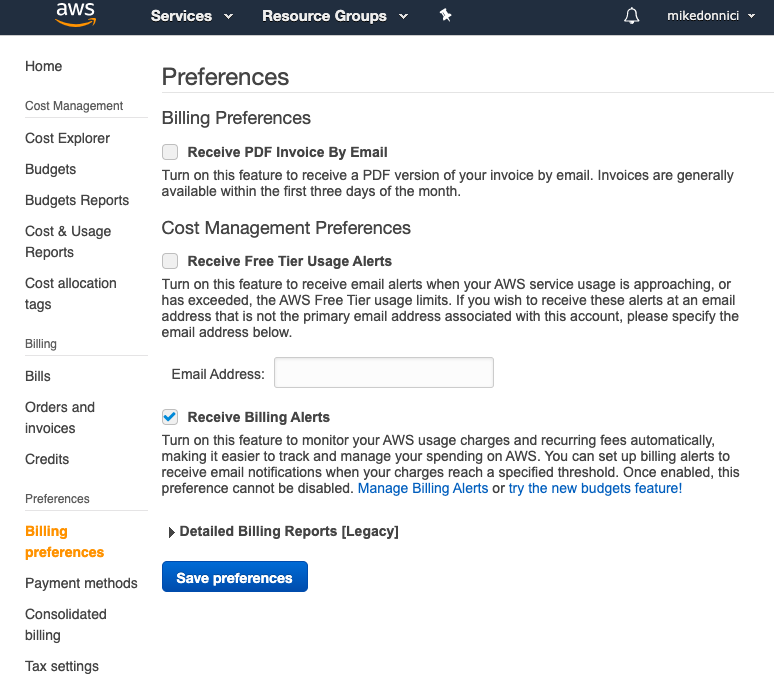
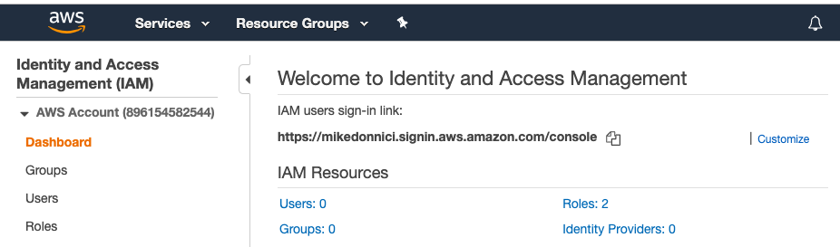
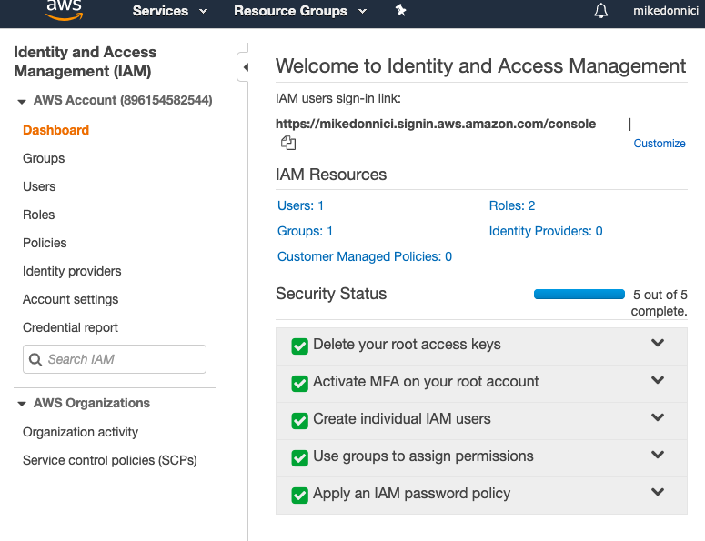

# AWS

Suggested Path for Cloud Architect gig:

Cloud Practitioner

Solutions Architect - Associate
Developer - Associate
SysOps Administrator - Associate

Security - Specialty
Big Data - Specialty (opt)
Advanced Networking - Specialty (opt)

DevOps Engineer - Professional
Solutions Architect - Professional

## Support Levels

- Basic - free
- Developer: \$29 / month, scales by usage
- Business: \$100 / month, scales by usage
- Enterpise: \$15,000 / month, scales by usage, incluse Technical Account Manager (TAM)

## Billing Alarms

Billing Dashboard -> Billing Preferences -> Receive Billing Alerts



Then:

CloudWatch ->Alarms: Billing -> Create Alarm

- Set up the alarm metric
- Create Simple Notification Service (SNS) topic

## IAM

**IAM - Identity Access Management**

Can create a customized login url for IAM users:



- Enable MFA on root account, eg with Google Authenticator
- Set up an IAM user, 3 options for ways to access:
  - Programatically
  - Web Console
  - SDKs
- Add user to a group:
  - Can select from Amazon-managed group policies
  - Users in group inherit policies
  - Optional tags for role, departments etc
- Set up password policies

These steps will result in all green ticks status fro security status:



#### Key Points

- Identity Access Management (IAM) is not linked to any regions so all groups and users are created _globally_.
- Access AWS in three ways: web console, programatically (cli), SDK
- Should always secure root account with MFA and set up access with IAM users and groups
- Policies are applied to a user/ group to set permissions, these are in JSON format

## S3

**Simple Storage Service**

Overview:

- Provides storage for non-changing file objects
- 0 - 5TB size
- Unlimited storage
- Files stored in buckets, like folders
- Buckets share a universal namespace so must be universally unique
- Bucket url: https://s3.[region-name].amazonaws.com/[bucketname]
- **Successful uploads return HTTP 200**

Objects (files) are comprised of:

- key: the name of the object
- value: the file data as a sequence of bytes
- version id
- metadata
- subresources:
  - access control lists
  - torrent

Data consistency for S3:

- Read after Write consistency for PUTs of new objects - ie immediately available
- Eventual consistency for overwrite PUTs and DELETEs - ie can take some time to propogate so might see old file

S3 Guarantees:

- File durability 99.99999999999% - the 11 nines
- Built for 99.99% availability
- AWS guarantees 99.9%

Other features:

- Tiered storage
- Lifecycle management
- Versioning
- Encryption
- Security:
  - access control lists for individual files
  - bucket policies for entire bucket

### Storage classes

From highest to lowest cost, all are 99.99% availability, 11 9s durability.

1. **S3 Standard**

   - multi-device, multi-facility

1. **S3 - IA** (Infrequently Accessed)

   - lower fee for storage but fee for rapid retrieval

1. **S3 One Zone - IA**

   - as above but in a single zone

1. **S3 Intelligent Tiering**

   - Uses AI to optimise costs by moving objects to appropriate storage tier based on usage paterns

1. **S3 Glacier**

   - Low-cost data archiving with configurable retreival times from minutes to hours

1. **S3 Glacier Deep Archive**

   - Lowest cost with retreival time up to 12 hours

ref: <https://docs.aws.amazon.com/en_pv/AmazonS3/latest/dev/storage-class-intro.html>

Charge factors:

- Storage space
- Requests
- Storage management
- Data transfer
- Transfer acceleration (uses edge locations)
- Cross-region replication (simple bucket replication)

Restricting bucket access:

- Bucket policies
- Object policies
- IAM policies for users and groups

### Static Web Sites

Can host static web sites with S3 - to do so:

- Switch on static site hosting ans specify index and optional error page
- Allow public access:
  - Switch off _Block Public Access_
  - Enable public access to all files

A bucket policy is the easiest way to allow public access to the static web site files, eg for the bucket `mikedonniciwebsite`:

```json
{
  "Version": "2012-10-17",
  "Id": "Policy1569358300130",
  "Statement": [
    {
      "Sid": "Stmt1569358291907",
      "Effect": "Allow",
      "Principal": "*",
      "Action": "s3:GetObject",
      "Resource": "arn:aws:s3:::mikedonniciwebsite/*"
    }
  ]
}
```

## EC2

**Elastic Compute Cloud**


### Load Balancers

Can distribute requests to EC2 instances in different availability zones.

Three types:

- Application load balancer - layer 7 aware
- Network load balancer - high performance or static IPs
- Classic load balancer - test, dev, low cost


## RDS

**Relational Database Service**

Options at AWS include:

- SQL Server
- Oracle
- MySQL
- MariaDB
- PostGres
- Aurora

Two key features:

- Multi-AZ for disaster recovery
- Read replicas for perfomance


