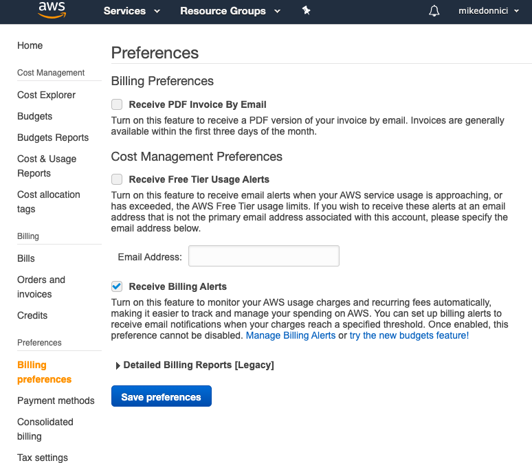
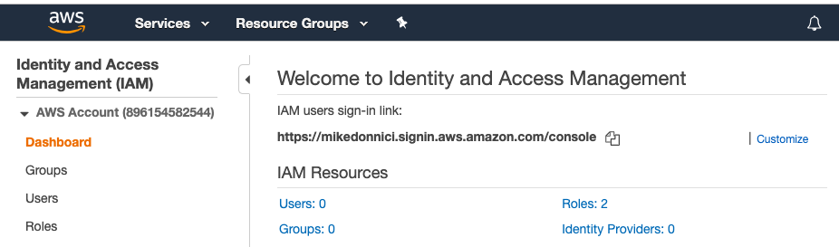
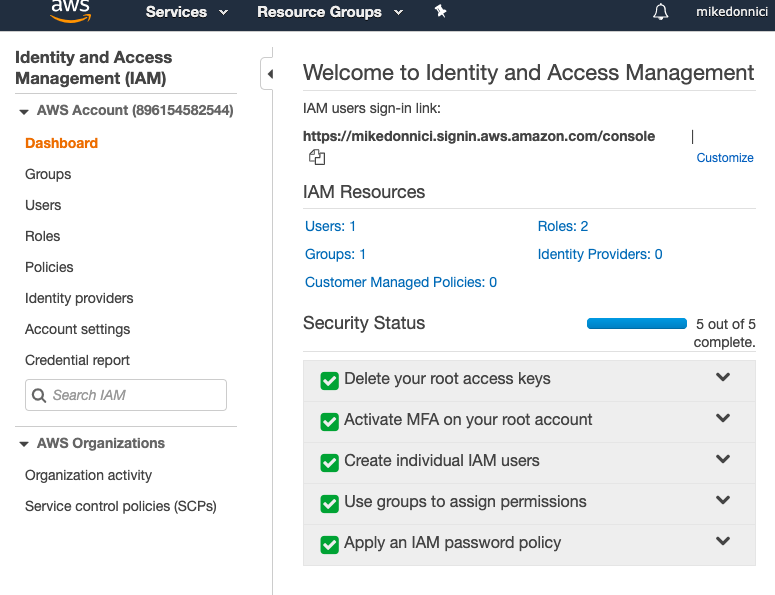

# AWS Cloud Practitioner


## Support Levels

- Basic - free
- Developer: \$29 / month, scales by usage
- Business: \$100 / month, scales by usage
- Enterpise: \$15,000 / month, scales by usage, incluse Technical Account Manager (TAM)

## Billing Alarms

Billing Dashboard -> Billing Preferences -> Receive Billing Alerts



Then:

CloudWatch ->Alarms: Billing -> Create Alarm

- Set up the alarm metric
- Create Simple Notification Service (SNS) topic

## IAM

**IAM - Identity Access Management**

Can create a customized login url for IAM users:



- Enable MFA on root account, eg with Google Authenticator
- Set up an IAM user, 3 options for ways to access:
  - Programatically
  - Web Console
  - SDKs
- Add user to a group:
  - Can select from Amazon-managed group policies
  - Users in group inherit policies
  - Optional tags for role, departments etc
- Set up password policies

These steps will result in all green ticks status for security status:



#### Key Points

- Identity Access Management (IAM) is not linked to any regions so all groups and users are created _globally_.
- Access AWS in three ways: web console, programatically (cli), SDK
- Should always secure root account with MFA and set up access with IAM users and groups
- Policies are applied to a user/ group to set permissions, these are in JSON format

## S3

**Simple Storage Service**

Overview:

- Provides storage for non-changing file objects
- 0 - 5TB size
- Unlimited storage
- Files stored in buckets, like folders
- Buckets share a universal namespace so must be universally unique
- Bucket url: https://s3.[region-name].amazonaws.com/[bucketname]
- **Successful uploads return HTTP 200**

Objects (files) are comprised of:

- key: the name of the object
- value: the file data as a sequence of bytes
- version id
- metadata
- subresources:
  - access control lists
  - torrent

Data consistency for S3:

- Read after Write consistency for PUTs of new objects - ie immediately available
- Eventual consistency for overwrite PUTs and DELETEs - ie can take some time to propogate so might see old file

S3 Guarantees:

- File durability 99.99999999999% - the 11 nines
- Built for 99.99% availability
- AWS guarantees 99.9%

Other features:

- Tiered storage
- Lifecycle management
- Versioning
- Encryption
- Security:
  - access control lists for individual files
  - bucket policies for entire bucket

### Storage classes

From highest to lowest cost, all are 99.99% availability, 11 9s durability.

1. **S3 Standard**

   - multi-device, multi-facility

1. **S3 - IA** (Infrequently Accessed)

   - lower fee for storage but fee for rapid retrieval

1. **S3 One Zone - IA**

   - as above but in a single zone

1. **S3 Intelligent Tiering**

   - Uses AI to optimise costs by moving objects to appropriate storage tier based on usage paterns

1. **S3 Glacier**

   - Low-cost data archiving with configurable retreival times from minutes to hours

1. **S3 Glacier Deep Archive**

   - Lowest cost with retreival time up to 12 hours

ref: <https://docs.aws.amazon.com/en_pv/AmazonS3/latest/dev/storage-class-intro.html>

Charge factors:

- Storage space
- Requests
- Storage management
- Data transfer
- Transfer acceleration (uses edge locations)
- Cross-region replication (simple bucket replication)

Restricting bucket access:

- Bucket policies
- Object policies
- IAM policies for users and groups

### Static Web Sites

Can host static web sites with S3 - to do so:

- Switch on static site hosting ans specify index and optional error page
- Allow public access:
  - Switch off _Block Public Access_
  - Enable public access to all files

A bucket policy is the easiest way to allow public access to the static web site files, eg for the bucket `mikedonniciwebsite`:

```json
{
  "Version": "2012-10-17",
  "Id": "Policy1569358300130",
  "Statement": [
    {
      "Sid": "Stmt1569358291907",
      "Effect": "Allow",
      "Principal": "*",
      "Action": "s3:GetObject",
      "Resource": "arn:aws:s3:::mikedonniciwebsite/*"
    }
  ]
}
```

## EC2

**Elastic Compute Cloud**


### Load Balancers

Can distribute requests to EC2 instances in different availability zones.

Three types:

- Application load balancer - layer 7 aware
- Network load balancer - high performance or static IPs
- Classic load balancer - test, dev, low cost


## RDS

**Relational Database Service**

Options at AWS include:

- SQL Server
- Oracle
- MySQL
- MariaDB
- PostGres
- Aurora

Two key features:

- Multi-AZ for disaster recovery
- Read replicas for perfomance


Static S3 sites will scale automatically.

## Cloudfront

CDN with many edge locations that delivers content closest to the client in order to reduce transfer time.

- **Edge Location**, as distinct from availability zones or regions, are places from where the content can be servedre seperate
- **Origin** is the source of the content, S3 bucket, EC2 instance, Elastic Load Balancer or Route53
- **Distribution** is a name given to the CDN which consists of a collection of Edge Locations.

Types of distributions:

- **Web Distribution** is most common
- **RMTP** used for streaming adobe media content

Note: Edge Locations are _not_ read-only - can PUT an object to them and can use S3 transfer acceleration.

Objects are cached for a TTL which is specified in seconds.

Can clear cache but charges will apply.

## EC2

Elastic Compute Cloud

Pricing models:

- On-Demand charged per second
- Reserved are contracted for a term (1 or 3 years) at a reduced cost
  - Standard - lowest cost butinstance type is fixed
  - Convertible - can change type if same or greater value
  - Scheduled - can launch within specified time
- Spot enables bidding for instances at a set price
- Dedicated hosts (physical servers), eg for some server-bound licensing or regulatory requirements

Note: For Spot pricing if the price rises above your set price you are not charged for the remaining part of the hour. However, if you terminate the instance yourself the balance of the hour will be charged.

### EBS

Elastic Block Storage is a virtual disk that can be attached to an EC2 instance.

Placed in same AZ as the instance and are automatically replicated to protect from single-component failure.

EBS comes in a few types types:

- SSD (SOlid-State Disk)
  - General Purpose SSD (GP2) - general use
  - Provisioned IOPS SSD(IO1) - high performance
- Magnetic
  - Throughput Optimized HDD (ST1) - low cost, frequent access
  - Cold HDD (SC1) - lowest cos, less frequent access eg file servers
  - Magentic - Previous generation

## CLI Basics

Hint: aws cli is installed on Amazon Linux by default so can access aws cli via an EC2 instance.

To configure access with access key id and secret access key:

```bash
$ aws configure
```

Credentials are stored in `~/.aws` folder - not all that secure.

Example

```bash
# make a bucket
$ aws s3 mb s3://mikedonnicibucket
# list buckets
$ aws s3 ls
# copy a file
$ aws s3 cp somefile.txt s3://mikedonnicibucket
# list contents of bucket
$ aws s3 ls s3://mikedonnictest
```

A more secure way to use the cli is with roles.

## IAM Roles

- IAM -> Roles -> Create Role
- Select service that uses the role, eg EC2.
- Attach permission policy, eg AmazonS3FullAccess.

The role now exists but has not been assigned to any service instance.

Locate the instance and then:

- Actions -> Instance Settings -> Attach/Replace IAM Role

Now if you log into the EC2 instance access to S3 is provided via the role that has been assigned to this EC2 instance.

Roles are:

- More secure that key id / secret key
- Easier to manage and configure policies
- Roles are universal like users

## RDS - Relational Database Service

- Multi-AZ for disaster recovery
- Read replicas for performance

## Route53 

- Domain Name Service
- Global scope, same as IAM and S3
- Register domain names
- Manage DNS zones

## Elastic Beanstalk

- Under _Compute_
- Automates deployment of web app infrastructure
- Configurable load balancing, scaling, monitoring

## CloudFormation

- Under _Management and Governance_
- Infrastructure as code
- Infrastructure deployment using code templates
- Uses Stack templates that represent infrastructure as code
- Handles the deployment of specified resources and their interconnectivity
- Service is free, resources are charged

## Best Practices

Key points from whitepaper: [AWS Cloud Best Practices](https://d1.awsstatic.com/whitepapers/AWS_Cloud_Best_Practices.pdf)

### Benefits of Cloud

- IT assests as provisioned resources, not physical resource
- Global, available and scalable capacity
- Higher-level managed services available - eg as machine learning
- Built-in security
- Architecting for cost efficiency

### Scalability design principles

- Scale up - more computing power, CPU, RAM
- Scale out - more instances behind a load balancer
  - Stateless applications (Lambda)
  - Load distribution
  - Stateless components
  - Stateful components
  - Session affinity (ie session with same node)
  - Distributed processing

### Disposal resources

Instantiating compute resource quickly using:

- Bootstrapping
- Golden images
- Containers
- Hybrid of above

**Should be no need to manually configure compute resources.**

Infrastructue as code using CloudFormation.

### Automation

Serverless management and deployment:

- Code pipeline
- Code deploy

Infrastructure management and deployment: 

- Elastic Beanstalk
- EC2 auto recovery
- Systems manager
- Auto scaling

Alarms and events:

- CloudWatch alarms
- CloudWatch events
- Lambda scheduled events
- WAF (Web Application Firewall) security automations

### Loose coupling

- Well-defined interfaces - API Gateway
- Service discovery
- Asynchronous integration - SQS (queues)
- Graceful failure for distributed systems

### Services not Servers

- Managed services
- Serverless architectures

"No server is easier to manage than no server" - Werner Vogels

### Databases

Aurora: relational DB, MySQL / Postgres compatible, scalable & HA

DynamoDB: No-SQL database, scalabale & HA

Neptune: graph database, scalable & HA 

### Removing single point of failure

- Failure detection
- Redundancy
- Durable data storage
- Automated multi-data centre resiliance
- Fault isolation
- Horizontal scaling
- Sharding data

### Optimise for cost

- Right sizing
- Elasticity
- Purchasing options - eg reserved instances

### Caching

- Application caching - ElasticCache
- Edge caching - CloudFront CDN

### Security

- Optimise for defence in depth - WAF etc
- Shared responsibility with AWS
- Use min permissions
- Security as code
- Real-time auditing - CloudTrail

## Service Scope

The following services are **global**:

- IAM - Identity Access Management
- Route53 - DNS services
- CloudFront - CDN 
- SNS - Simple Notification Service
- SES - Simple Email Service

Some services have a _global_ view but are **regional**:

- S3 - Simple Storage Service

## On-Premise Services

- Snowball - a physical hard disk for transferring large amounts of data, shipped back to Amazon.
- Snowball Edge - similar but has CPU so can use lambda functions. Used for where there is no connectivity but need AWS resources.
- Storage Gateway - similar to Snowball but stays on premises. Used to cache files locally and then replicate to S3.
- CodeDeploy - Can deploy locally as well as to remote servers. 
- Opsworks - similar to ElasticBeanstalk, uses Chef
- IoT Greengrass

So, OpsWorks and CodeDeply can be used to deploy applications on-premise as well as to the cloud.

## CloudWatch

- A service to monitor resources and applications.
- Can create custom metrics
- Can create alarms to trigger notifications

## AWS Systems Manager

- Used to manage a large number of EC2 instances - an _EC2 Fleet_.
- Can be used to run commands on many EC2 instances such as patching or updates.
- It uses software installed on each instance so can also be used on non-EC2 machines on-premise.
- Integrates with CloudWatch to give a dashboard of the entire estate.

## Billing and Pricing

Must read: <https://d0.awsstatic.com/whitepapers/aws_pricing_overview.pdf>

5 basic pricing policies:

- Pay as you go (for what you use)
- Pay less when reserving capacity
- Pay less (per unit) as usage increases
- Pay less as AWS grows
- Custom pricing


**Capex** - Capital Expenditure is paid up-front and is a fixed, sunk cost.

**Opex** - Operational Expenditure is pay for what you use, like utility billing.

- Understand the fundamentals of pricing:
   - Compute
   - Storage
   - _Outbound_ traffic
   
- Start early with cost optimisation
   - Implement cost visibility and control mechanisms _before_ environment grows large and complex
   
- Maximise the power of flexibility
   - Only use exactly what is needed, and no more
   - No time-based contracts (except for reserved) 
   - Don't pay for non-running resources so can switch on and off as required
    
   
- Use the right pricing model for the job
   - On-demand
   - Dedicated instances
   - Spot instances
   - Reservations

### Free Services

- Amazon VPC
- Elastic Beanstalk
- CloudFormation
- IAM
- Auto scaling (mechanism)
- Opsworks
- Consolidated billing

### Pricing factors

#### EC2

- Server up time
- Instance type
- Pricing model
   - on-demand: fixed, time-based rate (hour or second)
   - reserved: discount for 1 or 3 year contract
   - spot: bid on price for capacity, where application running can be flexible
   - dedicated host: where have existing server software licences
- Number of instances
- Load balancing
- Detailed monitoring (per minute costs more)
- Auto scaling (additional instances)
- Elastic IP addresses
- OS and software packages

#### Lambda

- Request pricing
   - Free tier: 1 million requests per month
   - $0.2 per 1 million requests
- Duration pricing
   - Free tier: 400K GB-seconds per month (up to 3.2 million seconds compute time)
   - $0.00001667 per GB-second thereafter   
- Additional charges
   - Data transfer
   - Read / write requests to S3
 
#### EBS

- Volumes
- Snapshots (backups)
- Data transfer    
   
#### S3

- Storage classes
- Amount of data stored
- Requests (GET, PUT, COPY)
- Data transfer

#### Glacier

- Storage
- Data retrieval time (slower costs less)   

#### Snowball

- Service fee per job
   - 50TB: $200
   - 80TB: $250
- Daily charge: 10 days free, then $15 per day
- Data transfer: into S3 is free, out is charged   

Note: Can be used to transfer data into amazon S3, or to migrate data OUT of S3.

#### RDS

- Server time
- DB type
- Number of instances
- Provisioned storage and type
- Requests
- Deployment types (multi-AZ etc)
- Data transfer  

#### CloudFront

- Traffic distribution
- Requests
- Outbound data transfer

### AWS Budgets vs Cost Explorer

- Budgets used BEFORE costs are incurred to alert when costs will (or have) exceeded budgets.
- Cost Explorer allows investigation into costs that have been incurred. 

### Support plans

- Basic
- Developer - $29/month
- Business - $100/month
- Enterprise - $15,000/month TAM

Response times vary between levels.

Business and Enterprise have < 1 hour response for production systems.

### Resource Groups and Tagging

- Tags are key-value pairs attached to AWS resources
- Used as _Metadata_ ie data about data
- Can be inherited by resources from CloudFormation templates

#### Tag Editor

Systems Manager -> Tag Editor:

- GLOBAL service
- Can specify one or more regions to search for resources
- Can then search (including by existing tags) for specific resource types in those regions
- With returned resources can manage tags for multiple resources

#### Resource Groups

Systems Manager -> Resource Groups:

- REGIONAL service
- Functions in a similar way (except it is regional) but allows the creation of named groups
- These named _groups_ can then be used in **Execute Automation** commands, ie can stop all resources in the group

### AWS Organisations

- Allows multiple AWS accounts to be consolidated into a organisation that can be centrally managed.
- Two feature sets:
   - Consolidated billing - resources managed separately but billing is unified, still get volume discounts - soft limit of 20 accounts
   - All features - all resources can be managed at organisational unit level
- Policies can be applied to **organisational units**, eg don't allow creation of EC2 instances

CloudTrail can be used to audit API access. For example, turn CloudTrail on in the paying account, and put all CloudTrail logs into a single S3 bucket in the 
paying account to provide a full audit trail for a complete organisation.

Paying account should not be used to deploy resources - only for billing management.

When monitoring is enabled on the paying account, the billing data for all linked accounts is included.

Can still create billing alerts for individual accounts.

Unused reserve instances can be applied across the group as well.

### Quickstart and Landing Zone

- Quickstart: <https://aws.amazon.com/quickstart>
- Provides pre-designed CloudFormation templates for many technology stacks
- Templates are built by AWS solutions architects with expertise in the particular technology stack

- Landing Zone: <https://aws.amazon.com/solutions/aws-landing-zone/>
- Helps to quickly set up secure, multi-account AWS environments using best practice.

### AWS Calculators


## Security in the Cloud

### Compliance on AWS and AWS Articfact

Can view various compliance programs that AWS conforms to, here:  <https://aws.amazon.com/compliance/>

Can get compliance documentation in AWS console: Security, Identity & Compliance -> Artifact

### Shared Responsibility Model

_**Important**_

**Security in the cloud is the responsibility of the customer**

AWS have the responsibility for everything up to OS and Software on some services, eg RDS.

Customer is responsible for operating systems on EC2, server protocols, networking configurations, IAM etc.

Read about [Shared Responsibility Model](https://aws.amazon.com/compliance/shared-responsibility-model/).

In short, if it's something you can do yourself it is likely your responsibility.

### AWS WAF and WAS Shield

- WAF - Web Application Firewall
- Protects from common web exploits
- Works at layer 7 in the application stack
- cf. a hardware firewall which works at layer 4

- AWS Shield protects against Distributed Denial of Service (DDoS) attacks
- Two tiers
   - Standard - automatically turned on with all new accounts
   - Advanced - costs $3000 per month but guarantees refund of DDoS-related expenses
   
### Inspector, Trusted Advisor and CloudTrail

- **AWS Inspector** assesses applications for security and compliance
- Produces a list of finding in order of severity / priority
- Installed as an agent on EC2 instances

- **AWS Advisor** - provides real-time guidance on:
   - cost optimisation
   - performance
   - security
   - fault tolerance
- Looks at entire AWS environment
- Comes in two flavours:
   - Core Check and Recommendations (free)
   - Full Trusted Advisor (Business and Enterprise customers only)
   
- **AWS CloudTrail** increases visibility into user and resource activity
- Records console actions and API calls
- Provides an account activity audit trail

### CloudWatch vs AWS Config

- **AWS CloudWatch** monitors _performance_ of AWS resources
- Use a lot with EC2 to monitor host-level metrics: CPU, network, disk etc
- Can also set up custom metrics

- **AWS Config** provides a detailed view of the _configuration_ of resources
- How resources relate to one another
- How their configurations have changed over time

### Athena vs Macie

- **Athena** allows query and analysis of S3 data using standard SQL
- Commonly used to analyse log data
- Charged per query and TB scanned

- **Macie** - Security service to discover, classify and protect sensitive data stored in S3
- Uses machine learning (AI) and natural language processing (NLP) to local personally Identifiable Information (PII) such as addresses, phone numbers, 
passport numbers, licence numbers, bank accounts, etc.
- Works with S3 data and also can scan CloudTrail logs
- Used to prevent identity theft - PCI-DSS compliance

 


 


 


    
   
   


 


- Available in two feature sets
   - [Simple Monthly Calculator](https://calculator.s3.amazonaws.com/index.html) - for monthly AWS cost estimates
   - [Total Cost of Ownership Calculator](https://awstcocalculator.com/) - comparison of in-house vs cloud


   
   


   


   
   
   


 


