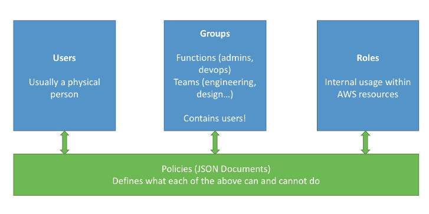

# Developer Associate

(Notes from Udemy course and other sources)

- https://www.udemy.com/course/aws-certified-developer-associate-dva-c01
- https://courses.datacumulus.com/certified-developer-k92

## AWS Regions and Availability Zones (AZ)

- AWS has _regions_ around the world, eg `us-east-1`
- Each region has _availability zones_, eg `us-east-1a`, `us-east-1b`
- Each availability zone is a distinct, physical data centre in the region
- AWS consoles are scoped to a region, _except_ IAM and S3
- AWS Region Sydney: `ap-southeast-2` has three availbility zones:
  - `ap-southeast-1a`
  - `ap-southeast-1b`
  - `ap-southeast-1c`

## IAM - Identity Access Management

- IAM has a GLOBAL scope
- IAM is at the center of AWS management for security and access:
  - Users
  - Groups
  - Roles
  - Policies
- Root account should not be used for day-to-day management
- Should use _least privilege principle_
  

**IAM Federation** is available for large enterprises to integrate with their own repository of users using SAML (Active Directory).

Important tips:

- One IAM _User_ per person
- One IAM _Role_ per application
- IAM creds should never be shared
- IAM creds should _never_ be committed or even written into code
- Root account and IAM creds should not be used except for initial setup

