# Developer Associate

(Notes from Udemy course and other sources)

- https://www.udemy.com/course/aws-certified-developer-associate-dva-c01
- https://courses.datacumulus.com/certified-developer-k92

## AWS Regions and Availability Zones (AZ)

- AWS has _regions_ around the world, eg `us-east-1`
- Each region has _availability zones_, eg `us-east-1a`, `us-east-1b`
- Each availability zone is a distinct, physical data centre in the region
- AWS consoles are scoped to a region, _except_ IAM and S3
- AWS Region Sydney: `ap-southeast-2` has three availbility zones:
    - `ap-southeast-1a`
    - `ap-southeast-1b`
    - `ap-southeast-1c`

## IAM - Identity Access Management

- IAM has a GLOBAL scope
- IAM is at the center of AWS management for security and access:
    - Users
    - Groups
    - Roles
    - Policies
- Root account should not be used for day-to-day management
- Should use _least privilege principle_

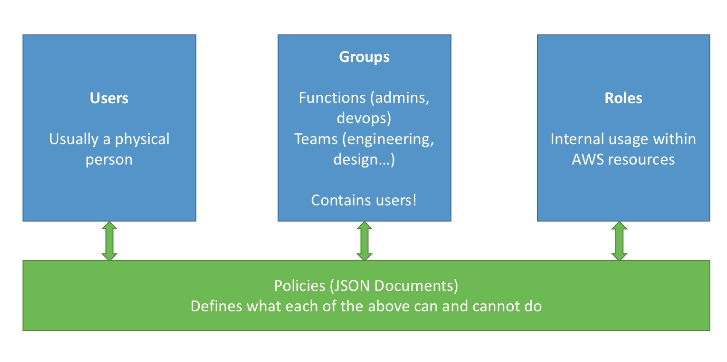

**IAM Federation** is available for large enterprises to integrate with their
own repository of users using SAML (Active Directory).

Important tips:

- One IAM _User_ per person
- One IAM _Role_ per application
- IAM creds should never be shared
- IAM creds should _never_ be committed or even written into code
- Root account and IAM creds should not be used except for initial setup

## EC2

_Elastic Compute Cloud_

- Encompasses:
    - Virtual machines (EC2)
    - Virtual drives (EBS)
    - Distributing load (ELB)
    - Scaling services (ASG)

- Launching an EC2 Instance:
    - Select AMI (Amazon Machine Image)
    - Configure options, including security group
    - Create and download security key
    - Launch

- Connect:
    - Change `.pem` file permissions from `0644` to `0400`
    - `$ ssh -i ~/path/to-my.pem ec2-user@public-ip`

### Security Groups

- Firewall for EC2 instances
- Regulates access to ports to / from IP addresses / ranges
- Can be attached to multiple instances
- An instance can belong to multiple security groups
- Locked down to a region / VPC combination
- Is _outside_ EC2
- TIP: Maintain one separate security group for SSH access
- _Application timeout_ is generally security group issue
- _Connection refused_ is application level issue, not security group
- By default all inbound traffic is blocked
- By default all outbound traffic is allowed
- Security groups can reference other security groups

### Elastic IPs

- Restarting EC2 instance can change its public IP (private IP remains
  unchanged)
- Elastic IPs are reserved public IPv4 addresses which can be attached to an EC2
  instance
- Can only have 5 elastic IPs per account - can request more
- TIP: Avoid elastic IP - bad architecture. Prefer random IP with DNS assignment
- Best pattern is to use a load balancer

### EC2 User Data

- Bootstrap EC2 instance using _EC2 User Data_ script
- Script runs once only on the instance's first start up
- Used to automate tasks such as installing updates, software and other tasks
- Run with root privileges
- Is on step 3 when configuring EC2 instance:

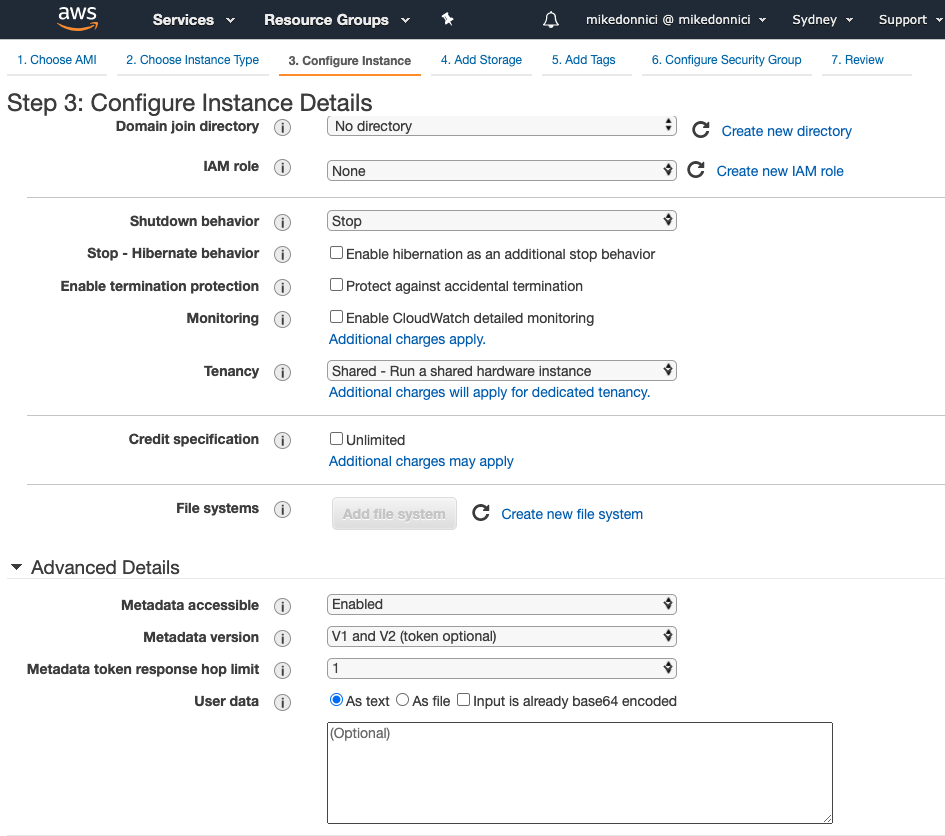

Example User Data script:

```shell script
#!/bin/bash
yum update -y
yum install -y httpd.x86_64
systemctl start httpd.service
systemctl enable httpd.service
echo "Hello from $(hostname -f)" > /var/www/html/index.html
```

### EC2 Instance Launch Types

- On Demand Instances: short workload, predictable pricing
- Reserved: MINIMUM 1 year
    - Reserved Instances: long workloads with same instance type
    - Convertible Reserved Instances: long workloads with flexible instance type
    - Scheduled Reserved Instances: eg every thursday from 3-6pm for one year
- Spot Instances: short workloads, cheap, can lose instances, less reliable
- Dedicated Instances: No other customers will share your hardware
- Dedicated Hosts: entire physical server, control instance placement

#### EC2 On Demand

- Pay per second after first minute
- Highest cost, no upfront payment
- No long-term commitment
- Recommended for: short-term, uninterrupted workloads, unpredictable app
  behaviour

#### EC2 Reserved Instance

- Reservation period can be 1 or 3 years
- Pay upfront with long-term commitment
- Up to 75% discount
- Reserve a specific instance type
- Recommended for steady state usage applications, eg database
- **Convertible Reserved Instances**
    - Can change EC2 instance type
    - Up to 54% discount
- **Scheduled Reserved Instances**
    - Launch in a reserved time window
    - When you require a known fraction of a month, week, day

#### EC2 Spot Instances

- Most cost-efficient instances - up to 90% discount
- Instances can be lost at any time if your **max price** is less than current
  spot price
- _Only useful for workloads that are resilient to failure_, eg:
    - Batch jobs
    - Data analysis
    - Image processing
- Single spot instance can be requested when launching an instance, on the _
  configure instance_ page
- Can also request a _fleet_ of spot instance via _Spot Request_ on left menu

A way to combine instances would be to have a reserved instance for baseline
capacity, plus on demand instance(s) and / or spot instances for peaks,
depending on if workload resilience is required.

#### EC2 Dedicated Instances

- Instances running on hardware that is dedicated to your account
- May share hardware with other instances in the _same_ account
- No control over instance placement (can move hardware after stop / start?)

#### EC2 Dedicated Hosts

- Physical, dedicated EC2 server
- Full control of instance placement
- Visibility into the underlying sockets, physical cores of the hardware
- 3 year period reservation
- Expensive
- Used for software that has complicated / restricted _Bring Your Own Licence_ (
  BYOL) model or regulatory requirements

### Elastic Network Interfaces (ENI)

- Logical component in a VPC that represents a virtual network card
- Bound to a specific AZ
- An ENI can have the following attributes:
    - Primary private IPv4, one or more secondary IPv4
    - One Elastic IP (IPv4) per private IPv4
    - One public IPv4
    - One or more security groups
    - A MAC address
- ENI can be created independently and can be attached / moved to EC2 instances
  for failover

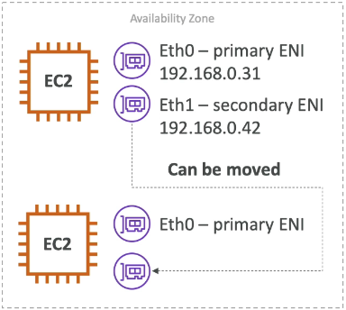

- Access ENIs via left menu on EC2 page:

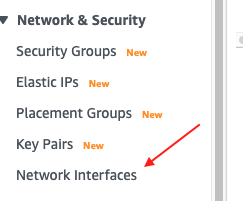

- Or via `eth0` link on an EC2 instance:

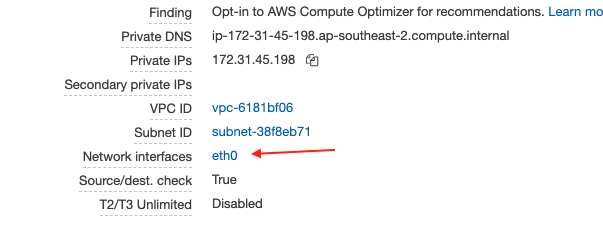

### EC2 Pricing

- Priced per hour, depending on:
    - Region
    - Instance type
    - Launch type (On-Demand, Spot etc)
    - OS
- Billed by the second with a min of 60 seconds
- Additional charges for storage, data transfer, elastic IP, load balancing etc
- **YOU DO NOT PAY IF THE INSTANCE IS STOPPED**
- https://aws.amazon.com/ec2/pricing/on-demand/

### Custom AMI

- Can create custom AMI for more efficient deployments
- **AMI ARE BUILT FOR A SPECIFIC AWS REGION**

### EC2 Instance Type

- Five distinct characteristics: RAM, CPU, I/O, Network, GPU (Graphical
  Processing Unit)
- Over 50 types: https://aws.amazon.com/ec2/instance-types/
- Comparison tool: https://ec2instances.info/
- Main categories:
    - R/C/P/G/H/X/I/F/Z/CR are specialised for RAM, CPU, I/O, Network, GPU
    - M instances are _balanced_ combination of all
    - T2/T3 instances are _burstable_
        - Can burst when load becomes high, this uses _burst credits_
        - Once credits are used reverts back to standard
        - Credits are re-accumulated over time
    - T2 Unlimited allows unlimited bursts but pay for extra credit

### EC2 Checklist

- SSH into EC2 instance, change `.pem` permissions
- Use security groups
- Know difference between private, public and elastic IP
- Use User Data to customise instance at boot time
- Know that can build custom AMI to enhance your OS
- EC2 instances are billed by the second and can be easily created and discarded

---

## High Availability and Scalability for EC2

- Vertical Scaling - instance size up / down
- Horizontal Scaling - number of instances increase / decrease (scale out / in)
    - Auto scaling group
    - Load balancer
- High Availability
    - Auto scaling group multi AZ
    - Load balancer multi AZ

### ELB (Elastic Load Balancer)

- Servers that fwd internet traffic to multiple backend instances
- Spreads load across multiple downstream instances
- Exposes a single point of access to the service
- Seamlessly handles failure of downstream instances
- Does regular health checks of instances
- Provides SSL termination
- Enforce stickiness with cookies
- High availability across zones
- Separate public traffic from private traffic

Advantages:

- Completely managed by AWS and guaranteed to work
- A lot less effort to configure
- Integrated with a lot of existing AWS services

#### ELB Health Checks

- Crucial for load balancers to know if instances are able to reply to requests
- Health check done on a port and route, eg /health:80
- Response 200 OK is healthy
- Happen every 5 seconds (configurable)

#### ELB Types

- **Classic Load Balancer** - CLB (v1 - old generation)
    - Supports HTTP & HTTPS (layer 7) and TCP (layer 4)
    - Health checks are TCP or HTTP-based
    - Fixed hostname `xxx.region.elb.amazonaws.com`, but _not_ a fixed IP

- **Application Load Balancer** - ALB (v2 - new generation)
    - supports HTTP, HTTP/2, HTTPS, WebSocket (Layer 7 only)
    - load balancing to multiple http applications across machines (_target
      groups_)
    - load balancing to multiple applications on the same machine (eg
      containers)
    - supports redirects (eg HTTP -> HTTPS)
    - supports routing tables to different target groups base on:
        - URL paths
        - host names
        - query strings and headers
    - Can route to multiple target groups
    - Health checks are at the target group level
    - Target groups can include:
        - EC2 Instances - can be managed by an Auto Scaling Group - ECS Tasks -
          Lambda functions - HTTP request translated to JSON event - IP
          addresses - must be private
    - Great for micro-services and container-based applications - Docker and
      Amazon ECS
    - Supports port mapping to redirect to dynamic ports in ECS
    - A single ALB can replace need to multiple CLBs
    - ALB has a fixed host name `xxx.region.elb.amazonaws.com`, but _not_ a
      fixed IP
    - App servers don't see the client IP directly, get the following headers
      added to the request":
        - `X-Fowarded-For` - client IP
        - `X-Forwarded-Port` - request port number
        - `X-Forwarded-Proto` - request protocol

- **Network Load Balancer** - NLB (v2 - new generation)
    - supports TCP, TLS (Secure TCP) & UDP (Layer 4 - lower level)
    - Forwards TCP / UDP traffic to instances
    - Much higher performance (lower latency ~ 100 ms vs ~400 ms for ALB)
    - Is not part of a security group and traffic is passed through as is - so
      security group containing target instances specifies where traffic is
      allowed from
    - Handles millions of requests per second
    - Has _one static IP per AZ_ and supports assigning Elastic IP
    - Not included in FREE tier

Can set up **internal** (private) load balancers or **external** (public) load
balancers.

#### Load Balancer Security Groups

Typically set up all traffic allowed to the load balancer, and traffic to EC2
instance only from ELB:

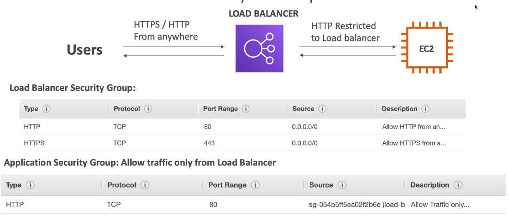

#### Load Balancer Stickiness

- CLB and ALB only
- Maintains client connection to same target using a cookie
- Cookie has a controllable expiration date
- Use case eg, to maintain session data
- May create a load imbalance to EC2 targets
- Enabled at the target group level (ALB)

#### Cross-Zone Load Balancing

- Normally, each LB distributes load to instances in the same AZ
- This ensures LB in each AZ distributed requests evenly amongst all registered
  instances in each AZ
- Classic Load Balancer - disabled by default, no additional charge
- Application Load Balancer - always on, no additional charges
- Network Load Balancer - disabled by default, additional charges

#### Load Balancer Checklist

- ELB can scale but not instantaneously - can contact AWS for 'warm up'
- Troubleshooting:
    - 4xx errors are client-induced
    - 5xx errors and application-induced
    - Load Balancer 503 means LB is _at capacity_ or _no registered target_
    - If LB can't connect to app, _check security groups_
- Monitoring:
    - ELB access logs will log _all_ requests so can debug at request level
    - CloudWatch Metrics provides aggregate statistics

#### SSL / TLS

- SSL cert allows traffic between load balancer and clients to be encrypted -
  _in-flight_ encryption.
- SSL - Secure Sockets Layer
- TLS - Transport Layer Security is newer version
- TLS certs are mainly used these days but are still referred to as _SSL_ certs.
- Public SSL certs are issued by a Certificate Authority (CA), eg LetsEncrypt
- SSL certs have an expiration date that you set, must be renewed regularly.
- Traffic from client to LB is HTTPS, then from LB to server is HTTP but is on
  private VPC so is secure.
- The LB uses an X.509 certificate (SSL/TLS certificate)
- Can manage certs in ACM (AWS Certificate Manager)
- Can also create and upload own certs
- HTTPS listener:
    - Must specify a default cert
    - Can add optional list of certs to support multiple domains
    - Client can use SNI (Server Name Indication) to specify the hostname they
      reach
    - Can also set specific security policy to support older versions of SSL /
      TLS (legacy clients)

##### SNI - Server Name Indication

- Solves problem of multiple SSL certs, ie for multiple web sites, on a single
  server.
- Problem was that TLS handshake did not include target hostname which means
  server had no way of knowing the correct cert.
- Newer protocol that requires the client to indicate the hostname of the target
  server in the initial SSL handshake.
- SNI works when using Application Load Balancer (ALB), Network Load Balancer
  (NLB) and CloudFront. Does NOT work for Classic Load Balancer (CLB).

In summary:

- Classic Load Balancer (v1)
    - supports one cert (CLB)
    - need multiple load balancers and certs for multiple hostnames
- Application Load Balancer and Network Load Balancer (v2)
    - supports multiple listeners with multiple SSL certs
    - uses SNI to make it work

#### ELB Connection Draining

- For CLB is called _connection draining_
- For ALB and NLB is called _target group deregistration delay_
- Specifies the time to complete _in flight_ requests when a target EC2 instance
  is de-registering or is unhealthy.
- Will stop sending _new_ requests to de-registering / unhealthy instance.
- By default is 300 seconds, can set 1-3600 seconds, or disable by setting to 0.
- Set to a low value if requests are short, eg simple web app
- Set higher for longer requests, eg complex db lookups

### Auto-scaling Groups

- Allows increase (_scale out_) and decrease (_scale in_) of EC2 instances in
  response to changing loads.
- Ensures a minimum and maximum number of instances.
- Automatically attaches instances to a load balancer.
- Settings for an auto-scaling group include the usual EC2 parameters and well
  as scaling policies and load balancer info.
- Auto Scaling Alarms use CloudWatch alarms to monitors metrics and trigger
  scaling, eg target average CPU usage, number of requests, network load etc.
- Can also create CloudWatch custom metrics.
- ASGs use _Launch Configurations_ or _Launch Templates_ (newer)
- To update an ASG you provide a new launch config / template.
- IAM roles attached to an ASG will also be assigned to an EC2 instance.
- ASG is free, pay for underlying resources.
- Instances under an ASG that are accidentally terminated will automatically be
  re-created - extra safety!
- For example, an instance might be marked as unhealthy by a load balancer, the
  ASG would then terminate and replace that unhealthy instance.

#### Scaling Policies

- _Target Tracking Scaling_
   - Simplest to set up
   - Eg, set average CPU usage for an ASG
- _Simple /Step Scaling_
   - Triggered by a CloudWatch alarm
   - Eg, alarm1: CPU > 70% then add 2 units, alarm2: CPU < 30% remove 1 unit
- _Scheduled Actions_
   - Anticipate scaling based on know usage patterns
   - Eg, scale up at start of business 9am.
  
#### Scaling Cooldowns

- Ensures previous scaling activity is able to complete before the next one is 
  initiated.
- Can set default cooldown as well as scaling-policy specific cooldowns, the 
  latter will override default.
  
---

## Elastic Block Storage (EBS) and Elastic File System (EFS)

### EBS

- EBS provides a network drive for attaching to EC2 instances
- Generally used to ensure persistent data storage if instance is terminated
- Scoped to a specific AZ, can be moved via a snapshot
- Get billed for provisioned capacity regardless of what is actually used
- Four types:
   - **GP2** (SSD) - general purpose
      - 1 GiB - 16 TiB
      - Small GP2 volumes can burst IOPS to 3000
      - Max IOPS is 16,000
      - 3 IOPS per GB so at 5334GB will be max IOPS 
   - **IO1** (SSD) - Highest performance for low-latency / high-throughput
      - Good for large database workloads
      - 4 GiB - 16 TiB
      - PIOPS (Provisioned IOPS) min 100 - max 32,000 (64,000 for Nitro 
        instances)
      - Max of 50 PIOPS per GiB
   - **ST1** (HDD) - Low cost HDD for frequently accessed high throughput
      - Streaming workloads requiring consistent, fast throughput, eg kafka, log 
        processing
      - 500 GiB - 16 TiB
      - Max throughput of 500 MB/s, can burst
      - Get 40 MB/s of throughput per TiB volume size
   - **SC1** (HDD) - Lowest cost HDD for lower throughput
     - 500 GiB - 16 TiB
     - Max throughput of 250 MB/s, can burst
- Only GP2 and IO1 can be used as boot volumes
 
#### EBS vs Instance Store

- Some instances have Instance Store rather than a root EBS volume  
- Instance Store is ephemeral storage - a physical disk attached to instance
- No network, so faster and data survives reboot
- Can't resize and is lost on instance stop or termination
- Backup must be done manually as cannot snapshot like EBS volumes
- IOPS is significantly higher than EBS

### EFS

- Managed Network File System (NFS) that can be mounted by multiple EC2 
  instances across multiple availability zones
- Highly available, scalable
- Approx 3 x cost of GP2 volume BUT only pay for what you use so cost effective 
  for small amount of storage
- Uses standard protocol NFSv4.1
- Control access to EFS using security group
- Can encrypt at rest using KMS (Key Management System)  
- Only works for POSIX file systems (ie Linux) that have standard file API
- File system scales automatically, pay-per-use so no capacity planning!
- Performance and Scale:
   - Thousands of concurrent NFS clients
   - 10GB+/s throughput
   - Can grow to petabyte scale
   - Two performance modes, set at EFS creation time:
      - General purpose - lower latency, good for web server, CMS etc
      - Max I/O - higher latency and throughput, highly parallel, for big data, 
        media processing etc
- Storage Tiers:
   - Standard for frequently accessed files
   - Infrequent Access (EFS-IA), lower storage fee but cost to retrieve files
   - Lifecycle management feature - move file after N days

See [Mounting EFS](https://docs.aws.amazon.com/efs/latest/ug/mounting-fs.html)   
   

---

## RDS - Relational Database Service

- Managed SQL databases as a service, available for:
   - Postgres
   - MySQL
   - MariaDB
   - Oracle
   - MS SQL
   - Aurora (proprietary, MySQL-compatible)
- Automated provisioning and patching
- Continuous backups and point-in-time restore
- Monitoring dashboards
- Multi-AZ for disaster recovery
- Maintenance windows for upgrades
- Vertical and horizontal scaling capacity
- Storage backed by EBS - GP2 or IO1
- CANNOT ssh into an RDS instance

### Automated Backups

- Daily full backups during maintenance window and transaction logs backed up 
  every 5 minutes
- This allows for a point-in-time restore to _any_ time up to five minutes ago   
- Default is 7 day retentions but can extend to 35 days
- Also has manual snapshots which any retention time

### Read Replicas

- Used for read scalability
- Can be same AZ, cross AZ and cross region
- Asynchronous replication so reads are eventually consistent
- Can promote a read replica to become its own database
- Application connection string is updated to be able to access read replicas
- Good for reporting, analytics and similar use cases
- There is a cost associated with data going across AZ
- Traffic within one AZ does not incur costs

### Multi-AZ for Disaster Recovery

- Synchronous replication to a different AZ
- Endpoint is a _single DNS name_ which allows automatic failover - ie Multi AZ 
  keeps the same connection string regardless of which database is up 
- Cannot read from, or write to the standby database - it is just there for 
  disaster recovery
- However, Read Replicas _can_ be set up as Multi-AZ for disaster recovery.  

### Security

- At-rest encryption
   - Can encrypt master and read replicas with AMS KMS - AES-246 encryption
   - Encryption is set and launch time
   - If master is not encrypted then read replicas cannot be encrypted
   - Transparent Data Encryption (TDE) available for Oracle and MS SQL 
    
- In-flight encryption:
   - Provide SSL options with trust certificate when connecting to the database
   - To _enforce_ SSL:
      -  Postgres: Parameter groups `rds.force_ssl=1` in console
      - MySQL within DB: `GRANT USAGE ON *.* TO 'mysqluser'@'%' REQUIRE SSL`
       
#### RDS Encryption Operations

- If RDS database is encrypted then snapshots will be encrypted, and vice-versa
- To encrypt and unencrypted database:
   - Create snapshot of unencrypted database 
   - Copy the snapshot and enable encryption for the snapshot
   - Restore the database from the encrypted snapshot
   - Migrate applications to the new database, delete old database
    
#### Network and IAM 

- RDS databases are usually deployed in a private subnet
- Leverage security groups in the same was as for EC2
- Access Management:
   - IAM policies used to control who can _manage_ AWS RDS
   - DB username and passwords used to login to the database, ie from an app
   - For Postgres and MySQL can also used IAM-based authentication
      - Requires an authentication token obtained via IAM and RDS API calls
      - Auth token has a lifetime of 15 minutes
      - Benefits: network io is encrypted, use IAM to manage DB users and can 
        leverage IAM Roles and EC2 instance profiles

### Aurora DB

- Compatible with Postgres and MySQL
- Cloud-optimised with significant performance improvements
- Aurora storage will automatically grow from 10GB - 64TB
- Can have up to 15 read replicas
- Failover is instantaneous and it is HA by design
- Costs about 20% more but is more efficient
- Key features:
   - Automatic failover
   - Backup and recovery
   - Industry compliance
   - Push-button scaling
   - Automated patching with zero downtime
   - Advanced monitoring
   - Routine maintenance 
   - Backtrack - point-in-time restore without relying on backups 

#### Aurora High Availability and Read Scaling

- Creates 6 copies of data across 3 AZ:
   - 4 copies of 6 needed for writes
   - 3 copies of 6 needed for reads
   - self-healing with peer-to-peer replication
   - Storage is striped across 100s of volumes
- One master instance is used for writes, master failover is generally < 30 secs
- Master plus up to 15 read replicas, each of which can be promoted on failover
- Supports cross-regional replication
- Provides both _writer_ and _reader_ endpoints (DNS name) in order to provide
  failover and read load balancing
  
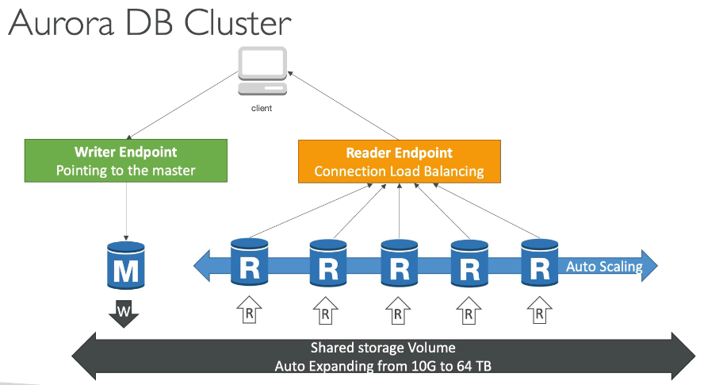

#### Aurora Security

- Similar to RDS - same db engines
- Encryption at rest using KMS
- Automatic backups, snapshots and replicas are also encrypted
- In-flight encryption using SSL (same as Postgres and MySQL)
- Possible to authenticate using IAM tokens (same as RDS)
- Still need to protect with security groups

#### Aurora Serverless

- Automatic database instantiation and autoscaling based on actual usage
- Good for infrequent, intermittent and unpredictable workloads
- Requires NO capacity planning
- Pay per second so can be cost-effective

#### Aurora Global

- Aurora cross-regional replicas - simple to create, good for disaster recovery
- Aurora Global Database (recommended):
   - 1 primary region for read and write
   - Up to 5 secondary read-only regions with replication lag < 1 second
   - Up to 16 read replicas per secondary region!
   - Good for decreasing read latency
   - Promoting another region for disaster recovery has RTO (Recovery Time 
     Objective) of less than 1 minute 

---

## ElastiCache

- Managed Redis or Memcached
- Caches are in-memory databases with very high performance and low latency
- Used to reduce load on databases for read-intensive workloads
- Can be used to store application state
- Write scaling using sharding
- Read scaling using read replicas
- Multi-AZ with failover

### Uses in application architecture

#### Data Store

- App tries to fetch data from a cache
- If there (_cache hit_) retrieval is very fast
- If not there (_cache miss_) app will fetch from RDS and then store in cache

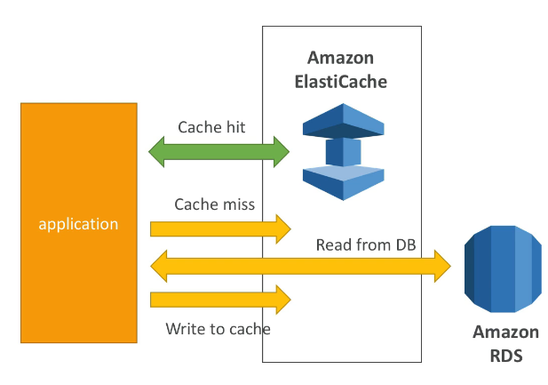


#### User Session - Stateless Apps

- Multi node app can be stateless if session data stored in a cache
- Initial login saves session data to cache
- Subsequent app requests, from any active node, fetch session data from cache 

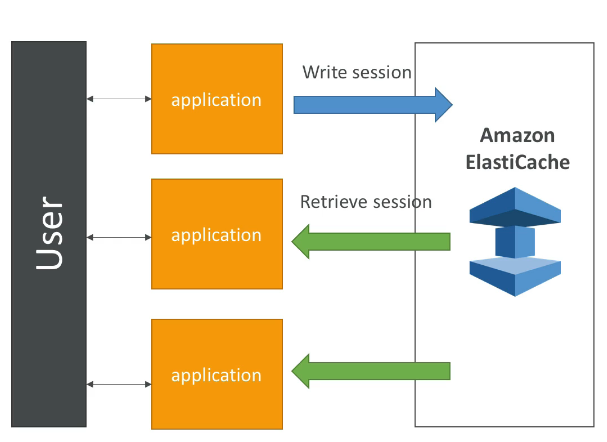


#### Redis vs Memcached

- Redis can be used as a database, cache and message broker
- Memcached is a pure, high-performance cache
- Redis has MultiAZ, auto failover, AOF persistence, backup and restore
- Memcached uses sharding and multi-threaded architecture (fast) but has no 
  persistence and hence no backup / restore.
  
#### Cache Strategies

- Suitability of data for caching depends a lot on type and structure of data 
- **Lazy Loading** (aka Cache-Aside, Lazy Population):
   - Cache hit or cache miss, on miss data retrieved from DB and then cached
   - Pros:
      - Only requested data is cached so cache not full of unnecessary data 
      - Node failures are not fatal, just increased latency
    - Cons:
       - Cache miss incurs _read penalty_ as 3 round trips to cache data
       - Data in cache can be stale depending on TTL, ie _eventually consistent_
- **Write Through**:
   - Add / update cache when database is updated
   - Often combined with lazy loading  
   - Pros:
      - Data in cache is _never_ stale
      - Write penalty (2 round trips) probably better UX than read penalty  
   - Cons:
      - Data is not in cache until added to DB can mitigate with lazy loading
      - _Cache churn_ - a lot of cache data will never be read
- **Cache Eviction and TTL** - three ways:
   - Explicitly delete cached item
   - Evict LRU (Least Recently Used) because memory is full
   - Set a suitable TTL - from a few seconds to hours or days, depends on data 
   - If cache is always full my need to scale cache up or out
    
---

## Route 53 DNS Service

- Public or private domains
- $0.50 per month per hosted zone
  

### DNS Record TTL 
- TTL specifies record lookup cache time  
- High TTL (eg 24 hours) reduced queries to DNS but may have outdated records
- Low TTL (eg 60 seconds) high queries but less chance of outdated records
- Default is 300 seconds (5 min)
- in a `dig` query the number beside the domain is the cache TTL remaining 
  before a new lookup - below it is `12`:
  
```shell
;; ANSWER SECTION:
mikedonnici.com.        12      IN      A       54.206.231.79
mikedonnici.com.        12      IN      A       54.206.202.192
```

### CNAME vs Alias

- CNAME:
   - Points a hostname to any other hostname
   - Only work for NON-root domains:
      - `host.dom1.com` -> `host.dom2.com`
- Alias:
   - Point a hostname to an AWS resource
   - Work for root and non-root domain names:
      - `host.dom1.com` -> `foo.amazonaws.com`
      - `dom2.com` -> `bar.amazonaws.com`
   - Free of charge
   - Native health check
- If pointing to an AWS resource use an Alias!


### Routing Policies

- **Simple**:
   - Redirect to a single resource
   - Cannot attach health checks
   - If multiple values are returned one is chosen at random by the _client_ - 
     client-side load balancing

- **Weighted**:
   - Control specific % of requests that go to endpoints
   - Eg: 70, 20, 10 - NB weights do not need to add to 100
   - Helpful to split traffic between regions
   - Can be associated with health checks 
   - Client is not aware of multiple IPs - ie only one is returned 
    
- **Latency**:
   - Redirect to server with lowest latency, ie closest

- **Geolocation**:
    - Different from latency-based!
    - Routing based on the user's location - continent, country or US state
    - Requires a default policy for when there is no match
    
- **Failover**:
   - Based on health checks (see below)
   - Mandatory health check on a primary endpoint
   - If primary is unhealthy DNS will respond with address of secondary 
    
- **Multi-Value**:
   - Used to route traffic to multiple resources
   - Also to associate Route53 health checks with records
   - Will return up to 8 of N records for each multi-value query
   - **NOT** a substitute for an ELB
    
    
    
### Health Checks
- Set up in Route53 
- N health checks fail (default 3) -> _unhealthy_
- N health checks pass (default 3) -> _healthy_
- Default health check interval is 30 seconds
- Can increase frequency to 10 seconds for increased cost
- Approx 15 health checkers will check endpoint health so 15 every 30 seconds 
  means an average of 2 seconds between health check requests
- Health checks can be HTTP, HTTPS, TCP but no SSL cert. verification
- Can integrate health checks with CloudWatch
- Health checks can then be used in failover routing policy


### VPC - Virtual Private Cloud

- A VPC is a _regional_ resource
- **Subnets** (AZ resource) used to partition VPC:
   - _Public Subnet_ - accessible from the internet
   - _Private Subnet_ - not accessible from the internet
- **Route Tables** define access to the internet and between subnets

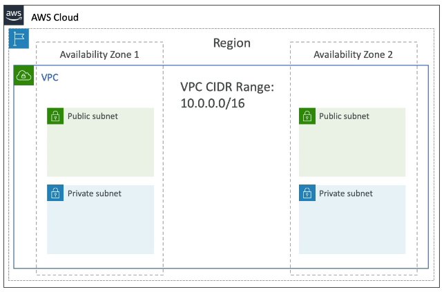

- Default VPC is created automatically in every region
- Each default VPC will have a default public subnet

#### Internet Gateways and NAT Gateways

- _Public_ subnets have a route to an internet gateway (IGW) so instances added 
  to a public subnet have access to tne internet via this gateway.
- **NAT** allows access to the internet for instances in a private subnet
- _Private_ subnets can have access to the internet via: 
   - a NAT Gateway (AWS-managed), or
   - a NAT Instance (Self-managed)
- A NAT Gateway / Instance is deployed in a _public_ subnet and then the 
  _private_ subnet is given a route to the NAT Gateway / Instance, which in turn
  has access to the internet gateway.

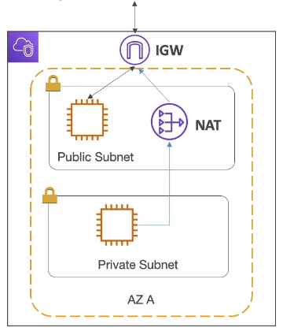

 
#### Network ACL and Security Groups

- **Network Access Control List**:
   - NACL is a firewall that controls traffic to and from the subnet
   - ALLOW and DENY rules
   - NACLs attached at subnet level 
   - Rules are at subnet level
   - Default is everything in and everything out
    
- **Security Groups**:
   - Firewall that controls access to ENI (Elastic Network Interface) / EC2 instance
   - Only has ALLOW rules
   - Rules include other security groups as well as IP addresses 

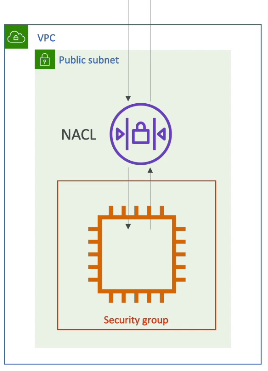

- **VPC Flow Logs**:
   - Captures info about IP traffic to interfaces:
      - VPC Flow Logs
      - Subnet Flow Logs
      - Elastic Network Interface Logs
- Use to monitor and troubleshoot connectivity issues:
   - Subnets -> Internet
   - Subnets -> Subnets
   - Internet -> Subnets 
- Captures network info for AWS-managed  interfaces as well, ElastiCache, RDS, Load Balancers etc
- VPC Flow Logs can be sent to S3 or CloudWatch

#### VPC Peering

- Creates private connection between two VPCs so they behave as if in the same network
- Must not have overlapping CIDR range
- Not _transitive_, ie if A <--> B and A <--> C the A |--| C - must be explicitly connected

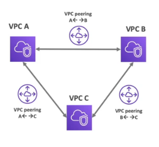


#### VPC Endpoints

- VPC Endpoints allow private network connection to AWS services instead of the public internet (default)
- Enhanced security and lower latency
- **VPC Endpoint Gateway** for connection to S3 and DynamoDB
- **VPC Endpoint Interface** for connection to other services
- Only used within your VPC

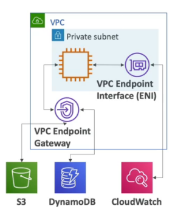


#### Site-to-Site VPN and Direct Connect

- Site-to-site VPN:
   - Connect on-premises VPN to AWS
   - Encrypted connection over the public internet
- Direct Connect (DX)
   - Establish a physical connection between premises and AWS
   - Private, secure and fast over _private_ network
   - Takes a month or so to set up
- Neither of these options can access VPC Endpoints


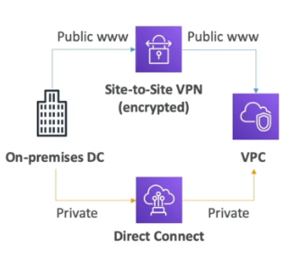


### Solution Architecture

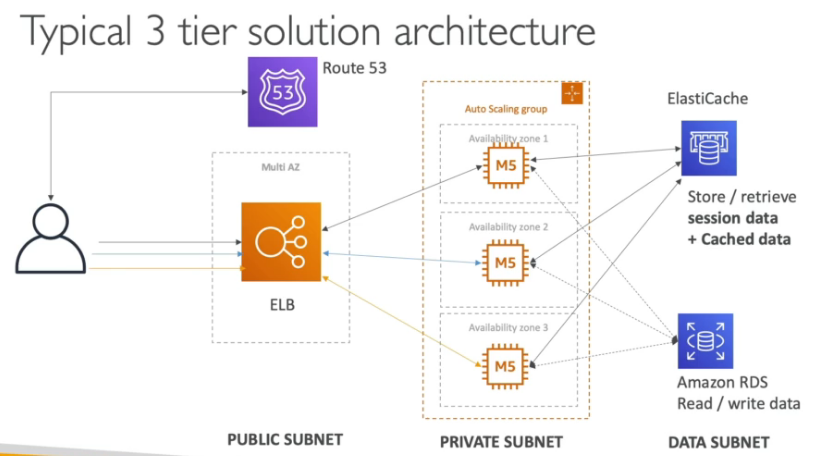

--

## Amazon S3

### Buckets and Objects

- Directories (Buckets) and Files (Objects)
- **Buckets**/l
   - Must have globally unique name
   - Despite the above, buckets are defined at the _regional_ level
   - Bucket naming conventions:
      - 3-36 characters, no uppercase, no underscore
      - Not an IP
      - Must start with lowercase letter, or a number 
- **Objects**:
   - Have a key which is _full path_ (excluding bucket name) to the object
   - Key _prefix_ is the virtual dir path up the the file name
   - `s3:/bucket-name/this/is/the/prefix/somefile.png` 
- No real concept of directories, just keys that contain slashes    
- Object _values_ are the contens of the body:
   - Max object size is 5000GB (5TB)
   - For upload more than 5GB must use _multi-part upload_
- Metadata key-value pairs can be added to objects
- Tags (unicode, up to 10) can also be added - useful for security or lifecycle
  policy
- Versioning is also available

### S3 Versioning

- Enabled at the bucket level
- If upload a file with same key will create a new version
- Is best practice to enable versioning to protect against accidentaql deletes
- Files not versioned _prior_ to enabling versioning will have Version ID `null`
- Suspending versioning does not delete previous versions
- Deleting an object creates a _delete marker_ on that object
- The delete marker is like a version of the object with a Version ID and size 
  0 bytes  
- To undelete the object the _delete marker_ Version ID can be deleted - 
  this is a _permanent delete_ and the object is restored to the previous version.  
- To rollback the later version is _permanently deleted_

### S3 Encryption for Objects

- Four methods of at-rest encryption:
   - **SSE-C3**:
      - Server-Side Encryption with AES-256 encryption algorithm
      - Keys managed by AWS
      - Required header: `"x-amz-server-side-encryption": "AES256"`
      - HTTP or HTTPS
   - **SSE-KMS**:
      - Server-Side Encryption using keys managed with KMS
      - Advantages are user control and audit trail
      - Required header: `"x-amz-server-side-encryption": "aws:kms"`
      - HTTP or HTTPS    
   - **SSE-C**:
      - Server-Side Encryption using own keys managed outside of AWS
      - S3 does _not_ store the provided encryption key
      - Encryption key must be provided in the headers with each request
      - HTTPS only
   - **Client-side encryption**:
      - Can use client library such as Amazon S3 Encryption Client
      - Client-side encryption before sending and decryption on retrieval
      - Customer manages keys and encryption
- Encryption in transit:
   - S3 exposes HTTP and HTTPS endpoints, latter providing in-transit encryption
   - Uses SSL/TLS certificates 

### S3 Security

- User-based:
   - IAM policies - which API calls allowed for specific IAM users
- Resource-based:
   - Bucket policies - bucket-wide rules, allow cross-account access
   - Object Access Control List (ACL) - finer grained control at object level
   - Bucket ACL - as above, at bucket level (less common)
- An IAM principal (ie account, user, role) can access an S3 object if:
   - The User IAM allows it, OR the resource policy allows it
   - AND there is no explicit DENY policy
    
#### S3 Bucket Policies

- JSON format
- Effect: Allow or Deny
- Principal: The account, user, role targeted by the policy
- Actions: Set of API calls included in policy
- Resources: the buckets and objects affected

```json
{
  "Statement": [
    {
      "Effect": "Allow",
      "Principal": "*",
      "Action": "s3:GetObject",
      "Resource": [
        "arn:aws:s3:::examplebucket",
        "arn:aws:s3:::examplebucket/*"
      ]
    }
  ]
}
```

- Use cases for bucket policies:
   - Grant public access
   - Force encryption at upload
   - Grant cross-account access
    
- Blocking public access (to avoid company data leaks) can be done via:
   - _New_ ACLs
   - _Any_ ACLs
   - _New_ pubic bucket or access point policies
- Blocked public access should be left on unless public access is required
- Can be set at the account level

- Private access to S3 can be provided via VPC endpoints
- Logging and Audit:
   - S3 logs stored in S3
   - API calls logged to CloudWatch
- User Security:
   - MFA delete can be required in versioned buckets
   - Pre-signed URLs for objects

### S3 Static Web Sites

- Can serve a bucket as a static web site
- Enable _Static Website Hosting_
- Disable _Block all Public Access_
- Create a bucket policy, `Allow * GetObject`
- Availavle at https://<bucket>-s3-website-<region>.amazonaws.com

### CORS

- Cross Origin Resource Sharing
- _Origin_ is a _scheme_ (protocol), _host_ (domain) and _port_, eg 
  https://foo.somewhere.com:443
- Browser-based security that allows requests to _other_ origins if _other_ 
  origins allow it, using CORS header `Access-Control-Allow-Origin`
- Example:
   - Browse to https://www.8o8.io - this is the _origin_
   - Retrieves `index.html` which makes a _cross origin_ request to 
     https://img.8o8.io/dog.png 
   - Browser will do a _preflight request_ (`OPTIONS`) to https://img.8o8.io 
     in order to find out what it will allow as far as CORS goes
   - -preflight response_ from https://img.8o8.io responds with headers:
      - `Access-Control-Allow-Origins: https://www.8o8.io`
      - `Access-Control-Allow-Methods: GET`
   -  Browser makes `GET` request for https://img.8o8.io/dog.png

- Same rules apply for cross-origin requests to S3 buckets serving websites
- CORS headers must be defined on the _cross origin_ site to allow requests 
  from the _origin_, or any origins with `"*"` 

### S3 Consistency Model

- Read after write consistency for `PUT` of new objects, `PUT 200 => GET 200`
- Unless you check for object first and not there, then get _eventual_ 
  consistency, `GET 404 => PUT 200 => GET 404 ... GET 200` 
- _Eventual_ consistency for `DELETE` and `PUT` of existing objects so original 
  object may be available until object is updated / deleted.
- NO OPTION for _strong_ consistency


  


## ECS, ECR & Fargate

- Docker images stored in Docker Repositories, eg:
   - Docker Hub
   - Amazon Elastic Container Registry (ECR)

### ECS Clusters

- Logical grouping of EC2 instances running ECS agent (Docker container)
- ECS agent registers the instance with the ECS cluster
- EC2 instances runa  special AMI made specifically for ECS.

### ECS Task Definitions

- JSON metadata that tells ECS _how_ to run a Docker container
- Contains things like:
   - Image name
   - Port bindings for container and host
   - Memory and CPU allocation
   - Env vars
   - Networking config (nb. default is `Bridge`)
- It is a _definition_ (ie a plan) for how somethign should be run    

### ECS Service

- Defines a number of tasks that should be run, and how they should be run
- Ensures that tasks are running across available EC2 instances in the cluster
- Can also be linked to load balancers (ELB, NLB, ALB) if needed
  
### ECS Service Load Balancing

- When containers are run without host port forwarding docker starts them on 
  random ports like `32657`
- Application Load Balancer has _dynamic port forwarding_ which can pick up these
  port numbers and forward the inbound port (eg 80) to the random ports 
  opened by running docker containers.
- Thus, can run multiple containers (based on the same image) on multiple EC2 
  instances without port clashes.
- Note: Still need to specify the _Container port_ in the task container 
  definition, but leave the _Host port_ empty:
  
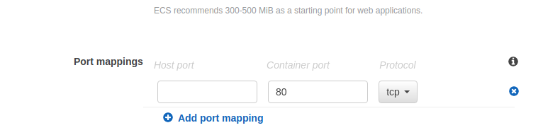
  

### ECR

- Elastic Container Registry for private images
- Access is controlled through IAM
- To login (with Docker) to ECR:
   - AWS CLI v1:
      - `$(aws ecr get-login -no-include-email --region ap-southeast-2)`
      - `$()` executes the output of the command inside the brackets
   - AWS CLI v2:
      - `aws ecr get-login-passwd --region ap-aoutheast-2 | docker login 
        --username --passwd-stdin 485629009920.dkr.ecr.ap-southeast-2.amazonaws.com`
- Auth credentials are then stored in `.docker/config.json`       
- Can also generate the auth command when a repo is created in ECR
- Note: may also need to use `aws --profile [someone]` 
- Once authenticated can use `docker push` and `docker pull` as usual

