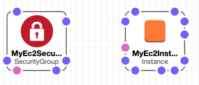
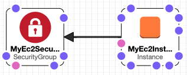

# AWS Solutions Architect Associate

## CloudFormation

CloudFormation is an _Infrastructure-as-Code_ tool for AWS.

Traditional servers were slow to set up, and hard to scale. 

Improvements were made using custom scripts but this was still complex to manage, error prone and difficult to scale.  

Infrastructure as code allows for provisioning of resources in a safe, repeatable way with minimal manual actions and 
without the need for custom scripts. 

### Infrastructure as Code

Uses software development techniques and tools such as version control, testing and CI /CD, as a way of managing 
configuration, provisioning and deployment of infrastructure resources.

Benefits are:

- cost reduction
- speed
- reduced risk

Starts with a _template_ which is like a blueprint. The template is code so can be versioned, tested etc.

The template is passed through some tooling which works out what needs to be done to get the infrastructure into the 
desired state.

Examples of Infrastructure as code tooling:

- CloudFormation
- Terraform
- Chef
- Puppet

The tooling then makes API calls to the target environment to provision the services.

CloudFormation is a tool designed specifically for use with AWS resources. 

_There is no costs for it's use, only the resources that are provisioned._

Simple CloudFormation template:

```yaml
Resources:
  Ec2Instance:
    Type: AWS::EC2::Instance
    Properties:
      InstanceType: t2.micro
      ImageId: ami-467ca739 # Amazon Linux AMI in N.Virginia
      Tags:
        - Key: Name
          Value: A simple example
```

### Terminology

**Templates** - JSON or YAML text files that are input into CloudFormation as a _blueprint_ that describes the end state 
of the infrastructure.

**Stack** - the result of the execution of a template; a set of related resources managed as a single unit, ie a _stack_ 
of resources.

**Change Set** - shows how updating a stack will impact on running resources; crucial for prod systems as some 
template/stack updates will re-provision resources and may result in data loss.

### Template Anatomy

Top-level sections of a CloudFormation template:

JSON:
```json
{
  "AWSTemplateFormatVersion" : "version date",
  "Description" : "JSON string",
  "Metadata" : { template metadata },
  "Parameters" : { set of parameters },
  "Mappings" : { set of mappings },
  "Conditions" : { set of conditions },
  "Transform" : { set of transforms },
  "Resources" : { set of resources },
  "Outputs" : { set of outputs  }
}
```

YAML:
```yaml
---
AWSTemplateFormatVersion: "version date"
Description:
  String
Metadata:
  template metadata
Parameters:
  set of parameters
Mappings:
  set of mappings
Conditions:
  set of conditions
Transform:
  set of transforms
Resources:
  set of resources
Outputs:
  set of outputs
```

These are all optional: 

AWSTemplateFormatVersion - only one valid value at the moment - "2010-09-09"
Description - text description
MetaData - further information about the template
Parameters - values that can be passed in to the template
Mappings - key-value pairs that can operate as a lookup table
Conditions - place conditions on whether or not certain resources are created
Transforms - specify transforms that will be used to process the template, eg code snippets, versions for serverless
Output - defines values to be returned from the stack

Only required section:

**Resources** - defines the template stack resources

Resources section (YAML)

```yaml
Resources:
  Logical ID:
    Type: Resource type
    Properties:
      Set of properties
```

Example:

```yaml
Resources:
  MyEC2Instance:
    Type: "AWS::EC2::Instance"
    Properties:
      ImageId: "ami-0ff8a91507f77f867"
```

The `Properties` list will depend on the type of resource.

Ref: <https://docs.aws.amazon.com/AWSCloudFormation/latest/UserGuide/template-anatomy.html>

### Features

#### [Intrinsic Functions](https://docs.aws.amazon.com/AWSCloudFormation/latest/UserGuide/intrinsic-function-reference.html)

- Built-in functions to help manage stacks
- Can be accessed within JSON or YAML templates

Example: Join function for concatenating string values with a specified delimiter

JSON: 
```json
{ "Fn::Join" : [ "delimiter", [ comma-delimited list of values ] ] }
```

```json
{ "Fn::Join" : [ ":", [ "a", "b", "c" ] ] }
```

YAML:
```yaml
Fn::Join: [ delimiter, [ comma-delimited list of values ] ]
# short form
!Join [ delimiter, [ comma-delimited list of values ] ]
```

```yaml
!Join [ ":", [ a, b, c ] ]
```

Sample usage:

```yaml
```yaml
Resources:
  Ec2Instance:
    Type: AWS::EC2::Instance
    Properties:
      InstanceType: t2.micro
      ImageId: ami-467ca739 # Amazon Linux AMI in N.Virginia
      Tags:
        - Key: Description
          Value: !Join[" ", ["EC2", "instance", "with", "tag", "joined"]]
```

#### Multiple Resources

The management of multiple resources is really the primary benefit of orchestration.

Under normal circumstance the _order_ of resource creation can be important. For example, for an EC2 instance to belong 
to a security group, that security group must already exist. 

CloudFormation can handle this for us via the `Ref` built in function.

Example:

```yaml
Resources:
  MyEc2Instance:
    Type: AWS::EC2::Instance
    Properties:
      InstanceType: t2.micro
      ImageId: ami-467ca739 # Amazon Linux AMI in N.Virginia
      Tags:
        - Key: Description
          Value: "An EC2 instance that *will* belongs to a security group"
  MyEc2SecurityGroup:
    Type: AWS::EC2::SecurityGroup
    Properties:
      GroupDescription: "Allow ssh port 22"
      SecurityGroupIngress:
        CidrIp: 0.0.0.0/0
        Description: "SSH"
        IpProtocol: tcp
        FromPort: 22
        ToPort: 22
```
The above creates the following stack:



The `Ref` will add the EC2 instance to the security group:

```yaml
Resources:
  MyEc2Instance:
    Type: AWS::EC2::Instance
    Properties:
      InstanceType: t2.micro
      ImageId: ami-467ca739
      Tags:
        - Key: Description
          Value: "An EC2 instance that *will* belongs to a security group"
      SecurityGroups:
        - !Ref MySecurityGroup # <-- this is Ref
  MyEc2SecurityGroup:
    Type: AWS::EC2::SecurityGroup
    Properties:
      GroupDescription: "Allow ssh port 22"
      SecurityGroupIngress:
        CidrIp: 0.0.0.0/0
        Description: "SSH"
        IpProtocol: tcp
        FromPort: 22
        ToPort: 22
```



An important thing to note is that if the above two templates are run one after the other, in either order - that is, 
the security group is added or removed, the the Ec2 instance is re-created and the original is deleted. This is a simple 
example of a fact that would be disclosed with a change set.

#### [Pseudo parameters](https://docs.aws.amazon.com/AWSCloudFormation/latest/UserGuide/pseudo-parameter-reference.html)

- Parameters that are predefined by CloudFormation
- Similar to environment vars
- Can be relied upon to be set correctly
- Referenced using the `Ref` intrinsic function

Commonly used:

- `AWS::AccountId` - The ID of the account in use
- `AWS::NotificationARNs` - List of notification ARNs for the current stack
- `AWS::StackId` - ID of current stack
- `AWS::StackName` - Name of current stack
- `AWS::Region` - A string representation of the AWS region in which the resource is being created

Example:

```yaml
Properties:
    GroupDescription: !Ref AWS::Region 
```

#### Mappings

Retrieves a desired value from a specified set of key-value pairs.

The map of key-value pairs is defined in the template and can then be subsequently accessed in other parts of the 
template. 

Values can be accessed using the intrinsic function `FindInMap`. 

```yaml
!FindInMap [ "MapName", "TopLevelKey", "SecondLevelKey" ]
```

For example, mapping AWS regions to AMI IDs:

```yaml
Mappings:
  MyRegionMap: # <-- logical id 
    us-east-1: # <-- top level key
      AMI: ami-1853ac65  # <-- "AMI" is second level key
    us-west-1:
      AMI: ami-bf5540df

# to access:
ImageId: !FindInMap # or Fn::FindInMap
    - "MyRegionMap"
    - !Ref AWS::Region # <-- intrinsic params to get stack region and thence correct AMI, eg "us-east-1"
    - "AMI"  # <-- returns "ami-1853ac65"
```

Here's a full example using template features thus far:

```yaml
Mappings:
  RegionMap:
    us-east-1:
      AMI: ami-1853ac65
    us-west-1:
      AMI: ami-bf5540df
    eu-west-1:
      AMI: ami-3bfab942
    ap-southeast-1:
      AMI: ami-e2adf99e
    ap-southeast-2:
      AMI: ami-43874721
Resources:
  Ec2Instance:
    Type: 'AWS::EC2::Instance'
    Properties:
      InstanceType: t2.micro
      ImageId:
        Fn::FindInMap:
        - RegionMap
        - !Ref AWS::Region
        - AMI
      SecurityGroups: 
        - !Ref MySecurityGroup
      Tags:
        - Key: "Name"
          Value: !Join 
            - ""
            - - "EC2 Instance for "
              - !Ref AWS::Region
  MySecurityGroup:
    Type: 'AWS::EC2::SecurityGroup'
    Properties:
      GroupDescription: Enable SSH access via port 22
      SecurityGroupIngress:
        - IpProtocol: tcp
          FromPort: '22'
          ToPort: '22'
          CidrIp: 0.0.0.0/0
```

#### Input Parameters

- allow input of custom values to a template
- defined in top-level `Parameters` section
- must be assigned a value at run time, can have a default value
- only required attribute is `Type`
- supported types
   - String
   - Number
   - List<Number>
   - CommaDelimitedList
   - AWS-specific types, eg AWS::EC2::Image::Id
   - Systems Manager Parameter types

Example:

```yaml
# definition
Parameters:
  MyInstType:      # defined logical name
    Type: String
    Default: t2.micro
    AllowedValues:
      - t2.micro
      - m1.small
      - m1.large
    Description: EC2 instance type
Resources:
  Ec2Instance:
    Type: AWS::EC2::Instance
    Properties:
      InstanceType:
        Ref: MyInstType   # <- reference to input
        ImageId: ami-2f726546 
```

#### Outputs

- allows access to information about resource in a stach, eg IP, DNS
- `Outputs` are defined at the top level of the template

```yaml
Outputs:
  InstanceDns:      # logical name
    Description: The instance Dns
    Value: !GetAtt    # instrinsic function 
      - EC2Instance   # logical name of the resource
      - PublicDnsName # attribute
```

### Setting up EC2 instances

- generally don't want an empty EC2 instance
- want to install and set up users, an application, configuration etc

#### UserData

- Resource type `AWS::EC2::Instance` has a property `UserData`

```yaml
Resources:
  Ec2Instance: # logical name
    Type: AWS::EC2::Instance
    Properties:
      UserData:
```

- `UserData` is Base64 encoded
- works on Linux and Windows (with slight differences)
- only runs on first boot cycle
- Windows:
   - Runs as local admin
   - Can run batch or powershell scrips
   - executed by EC2Config or EC2Launch (log locations vary)   
- Linux:
   - runs as root
   - non-interactive
   - logs output to `/var/log/cloud-init-output.log`
   - script specifies interpreter with `!#`, eg `#/bin/bash`
 
Example:

```yaml
Resources:
   EC2Instance: # logical name
      Type: AWS::EC2::Instance
      Properties:
         UserData: 
            !Base64 |  # intrinsic func, followed by | to denote literal block 
               #!/bin/bash -xe
               yum update -y
               yum install httpd -y
               service httpd start
```

- procedural scripting is not ideal
- CloudFormation provides Python helper scripts which are pre-installed on Amazon Linux
- these are _not_ executed automatically, but need to be called from the template
- the scripts themselves can / should be updated periodically via `yum` repo

##### Helper Scripts

- `cf-init` - reads and interprets metadata to execute AWS::CloudFormation::Init
- `cfn-signal` - signal when a resource or application is ready
- `cfn-get-metadata` - retrieve metadata based an a specific key
- `cfn-hup` - checks for updates to metadata end execute custom hooks

#### CloudFormation Init

- `cf-init` script enables the use of `AWS::CloudFormation::Init`

```yaml
Resources:
   MyInstance:
      Type: AWS::EC2::Instance
      MetaData: 
         AWS::CloudFormation::Init:
            config:      # config key named 'config' when only one, more than one uses `Configsets` (see below)
               packages: # a set of configuration sections  
               groups:
               users:
               sources:
               files:
               commands:
               services:
      Properties:
```

- `ConfigSets` used when more than one config set is required, specifies the order of execution
- See AWS CloudFormation Docs: [ConfigSets](https://docs.aws.amazon.com/AWSCloudFormation/latest/UserGuide/aws-resource-init.html#aws-resource-init-configsets) 


### Change Sets

- Aimed at reducing the risk of changing resources in production
- Change sets allow a preview of how changes will impact resources
- A Change Set consists of 4 possible ops:
   - **Create**: submit modified template and / or param values , nothing is modified
   - **View**: Shows proposed changes
   - **Execute**: performs the updates on the existing stack
   - **Delete:** deletes the Change Set without performing the updates

- [AWS Resource and Property Types Reference](https://docs.aws.amazon.com/AWSCloudFormation/latest/UserGuide/aws-template-resource-type-ref.html)
- [Update Behaviors of Stack Resources](https://docs.aws.amazon.com/AWSCloudFormation/latest/UserGuide/using-cfn-updating-stacks-update-behaviors.html)


 


 


