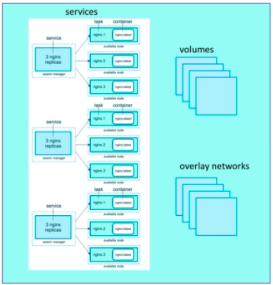

# Docker Swarm

Check if swarm enabled:

```shell
docker info
...
Swarm: inactive
...
```

Activate swarm:

```shell
docker swarm init
```

- Creates Root Signing Cert for swarm
- Issues cert for first manager node
- Creates join tokens
- Raft database is created to store root CA, configs and secrets
    - Encrypted on disk
    - No need for another key/value system to hold orchestration secrets
    - Replicates log amongst managers via mutual TLS in _control plane_

`docker swarm` is a narrow-scope command, for joining / leaving swarms,
promoting managers etc.

```shell
docker swarm --help
```

`docker node` command uses to manage nodes

Eg, show nodes:

```shell
docker node ls
ID                            HOSTNAME   STATUS    AVAILABILITY   MANAGER STATUS   ENGINE VERSION
se34h87576uup25vtwu4fo3c3 *   gsnsw      Ready     Active         Leader           20.10.6
```

`docker service` is the main command for doing things with swarm

Create a service:

```shell
docker service create alpine ping 8.8.8.8
rn1yfs2802a7tiynil1or8eqq <--- this is the service id
```

List services:

```shell
docker service ls
ID             NAME            MODE         REPLICAS   IMAGE           PORTS
rn1yfs2802a7   elastic_nobel   replicated   1/1        alpine:latest 
```

List tasks (service processes):

```shell
docker service ps elastic_nobel # <-- name or service id
ID             NAME              IMAGE           NODE      DESIRED STATE   CURRENT STATE           ERROR     PORTS
bunbot099yq2   elastic_nobel.1   alpine:latest   gsnsw     Running         Running 3 minutes ago
```

Scale service up:

```shell
docker service update elastic_nobel --replicas 3
...
docker service ls
ID             NAME            MODE         REPLICAS   IMAGE           PORTS
rn1yfs2802a7   elastic_nobel   replicated   3/3        alpine:latest
...
docker service ps elastic_nobel
ID             NAME              IMAGE           NODE      DESIRED STATE   CURRENT STATE                ERROR     PORTS
bunbot099yq2   elastic_nobel.1   alpine:latest   gsnsw     Running         Running 7 minutes ago                  
lkojtx8er6t7   elastic_nobel.2   alpine:latest   gsnsw     Running         Running about a minute ago             
ruib2ac070fg   elastic_nobel.3   alpine:latest   gsnsw     Running         Running about a minute ago 
```

Remove the service:

```shell
docker service rm elastic_nobel
```

## Swarm Cluster

Init swarm and advertise an IP accessible by other nodes

```shell
docker swarm init --advertise-addr [IP]
```

Then cut and paste the generated join command on the other nodes. To regenerate
the join command can run
`docker swarm join-token worker` or `docker swarm join-token manager`.

Swarm Visualiser, run this on one node

```shell
docker service create --name=viz --publish=8080:8080/tcp --constraint=node.role==manager --mount=type=bind,src=/var/run/docker.sock,dst=/var/run/docker.sock bretfisher/visualizer 
```

Then access on  `:8080`

### Overlay Multi-Host Networking

- When creating a network choose `--driver overlay` so that containers can
  access each other as though on a VLAN.
- This is for container-to-container traffic inside a single swarm.
- Can enable full encryption between containers using IPSec (off by default).
- Each service can be added to zero or more overlay networks.

Example - Creating a drupal network:

```shell
docker network create --driver overlay mydrupal
docker network ls
docker service create --name psql --network mydrupal -e POSTGRES_PASSWORD=mypass postgres
docker service create --name drupal --network mydrupal -p 80:80 drupal
```

Once this is complete the drupal app will respond on any IP, even if it is only
running on one node. This is because of the _routing mesh_.

### Routing Mesh

- Routes ingress packets for a _Service_ to the appropriate _Task_ (container)
- Spans all nodes in swarm
- Uses IPVS from Linux Kernel
- Load balances Swarm Services across their Tasks
- Two ways this works:
    - Container-to-container in an Overlay network - puts a Virtual IP in front
      of a Service and acts like a load balancer
    - External traffic incoming to published ports is routed to the correct
      container and port


- This is _stateless_ load balancing, ie cannot handle sessions
- Is layer 3 (IP/Port), not layer 4 (DNS)
- Both these limitations can be overcome using a reverse proxy, or Docker
  Enterprise Edition has a builtin layer 4 web proxy.

### Swarm Stacks in Production

- Stacks accept compose files as a declarative definition for services, networks
  volumes, and secrets.
- Use `docker stack deploy` instead of `docker service create`
- Stacks can manage all of the objects, including an overlay network, prefixed
  with the stack name.
- Compose file with use a `deploy:` key and cannot do `build:`
- Both `build:` and `deploy:` can exist in the compose file as Compose will just
  ignore `deploy:` and Swarm will ignore `build:`
- `docker-compose` cli does _not_ need to be present on the Swarm server as it
  is not considered to be a production tool. So Swarm can process the compose
  file without the need for `docker-compose`.
- A stack definition can be used to manage many services, but only a single
  swarm.
- Note: need to use version "3" or more for the compose file



- Example run:

```shell
docker stack deploy -c app-stack.yml appname
#... to deploy and then can look at things with:
docker stack ls
docker stack services appname
docker stack ps appname
```

- To update a stack, change the compose file and then redeploy it with the same
  command.

#### Secrets storage

- Easy, secure solution for storing secrets in Swarm.
- Encrypted on disk and in transit.
- Use for passwords, keys, TLS certs etc.
- Can store string or binary up to 500kb.
- Since Docker 1.13 Swarm Raft DB is encrypted on disk.
- Only stored on disk on _manager_ nodes
- Secrets are first stored in Swarm using `docker secrets` and then assigned to
  services.
- Only assigned services can see the assigned secrets.
- Secrets appear as files in the container but are actually stored in an
  _in-memory_ file system, eg:
    - `/run/secrets/<secret_name>`
    - `/run/secrets/<secret_alias>`
- Local `docker-compose` can use file-based secrets as well, but not secure.

Create a secret from a file:

```shell
docker secret create psqluser psql_user.txt
```

Echo a secret and read from stdin:

```shell
echo "superSecretPassword" | docker secret create psql_pass -
```

Note: need to ensure that secrets are not visible in bash history etc.

Can list and inspect secrets but will not be able to read the actual value -
this is only available to running containers.

```shell
docker secret ls
ID                          NAME        DRIVER    CREATED         UPDATED
k1heq0feos0tzkyexc2llb9y4   psql_pass             3 minutes ago   3 minutes ago
m0gjg9yz42d4fakvgiklxr5h0   psql_user             2 minutes ago   2 minutes ago
```

```shell
docker secret inspect psql_user
[
    {
        "ID": "m0gjg9yz42d4fakvgiklxr5h0",
        "Version": {
            "Index": 216
        },
        "CreatedAt": "2021-06-27T22:07:45.827612968Z",
        "UpdatedAt": "2021-06-27T22:07:45.827612968Z",
        "Spec": {
            "Name": "psql_user",
            "Labels": {}
        }
    }
]
```

#### Starting a container with secrets

Note that the postgres image has the convention of being able to set required
env vars from a file using `POSTGRES_USER_FILE` and `POSTGRES_PASSWORD_FILE`.

So to use swarm secrets as below the image would have to support a similar
convention so that it could read to secrets from the container
at `/run/secrets/`.

```shell
docker service create --name psql \
  --secret psql_user \
  --secret psql_pass \
  -e POSTGRES_USER_FILE=/run/secrets/psql_pass \
  -e POSTGRES_PASSWORD_FILE=/run/secrets/psql_pass \
  postgres
```

Can add or remove secrets for an existing service however this will recreate the
container:

```shell
docker service update --secret-rm [list]
docker service update secret-add [secret]
```

#### Using secrets with compose

- Needs `version: "3.1"` minimum

```yaml
# docker-compose.yml

version: "3.1"

services:
  psql:
    image: postgres
    secrets:
      - psql_user
      - psql_password
    environment:
      POSTGRES_USER_FILE: /run/secrets/psql_user
      POSTGRESS_PASSWORD_FILE: /run/secrets/psql_password

# secrets are defined at root level key and then assigned to specific images
secrets:
  psql_user:
    # can use file: or external:
    file: ./psql_user.txt
  psql_password:
    file: ./psql_password.txt
```

To start:

```shell
docker stack deploy -c docker-compose.yml mydb
```

Just to re-iterate, the above will _work_ with `docker-compose` locally as well.
It does this by copying the secrets to `/run/secrets` on the running container
as a normal file mount. This means it only works with `file:` secrets and not
`external:`.

This allows for local development environment to match the production
configuration but is _not_ secure. It is not _intended_ to be secure because
`docker-compose` is not intended for production use.

### Service Updates

- Rolling replacement of tasks/containers in a service
- Limits downtime depending on the type of service
- Will generally _replace_ containers
- `update` command has many options
- Many options are `create` options with a combination of `-add` and `-rm`
- Also includes `scale`, `rollback` and `healthcheck` options
- A `stack deploy` toa an existing stack will issue service updates

#### Examples

- Update image to a newer version

```shell
docker service update --image fooapp:1.2.1 <servicenmae>
```

- Add env var and remove a port:

```shell
docker service update --env-add MODE_ENV=production --publish-rm 8080
```

- Change replicas for two services:

```shell
docker service scale web=8 api=6 
```

- In a stack file just edit the `YAML` file and:

```shell
docker stack deploy -c file.yaml <stackname>
```

Example run:

```shell
# Create a service
docker service create -p 8088:80 --name web nginx:1.13.7

# Scale up
docker service scale web=3

# Change image version
docker service update --image nginx:1.13.6 web

# Switch ports (remove and add)
docker service update --publish-rm 8088 --publish-add 9090:80 web

# TIP: re-balance service (update with no changes)
docker service update --force web 

# Clean up
docker service rm web
```

### Docker Healthchecks

- Healthcheck feature added in 1.12, and can be used in many places
- Recommended for production
- Docker engine runs the command in the container, eg `curl localhost`
- Expects `exit 0` (ok) or `exit 1` (error)
- Healthcheck has 3 states:
    - Starting
    - Healthy
    - Unhealthy
- Better than _in binary still running?_ but not a replacement for monitoring
  tools
- Where healthcheck can be seen:
    - `docker container ls`
    - `docker contaienr inspect` - last 5 healthchecks
- Docker run does nothing with healthchecks
- Services will replace tasks if they fail healthcheck
- Service updates wait for healthchecks before continuing

**`docker run` example using Elastic Search image:**

```shell
docker run  \
  --health-cmd="curl -f localhost:9200/_cluster/health || false" \  
  --health-interval=5s \
  --health-retries=3 \
  --health-timeout=2s \ 
  --health-start-period=15s \
  elasticsearch:2
```

Note that ` || false` in the `curl` command ensures that `exit 1` is issued for
any error as `curl` can exit with other codes, but docker requires only `0`
or `1`. Could also use `exit 1` instead of `false`

**`Dockerfile` example using nginx:**

- Note this fails because `curl` cannot be found

```dockerfile
FROM nginx:1.13

HEALTHCHECK --interval=30s --timeout=3s CMD curl -f http://localhost/ || exit 1
```

- If above is built and run can inspect health with:

```shell
docker inspect <container_id> | jq .[0].State
```

**Compose/Stack file example:**

- Version "2.1" is minimum for healthcheck
- Version "3.4" is minimum for `start_period:`

```yaml
version: "3.4"

services:
  web:
    image: nginx
    healthcheck:
      test: [ "CMD", "curl", "-f", "http://localhost" ]
      interval: 1m30s
      timeout: 10s
      retries: 3
      start_period: 1m
```

**`docker service` example using postgres:**

```shell
docker service create --name pg --health-cmd="pg_isready -U postgres || exit 1" -e POSTGRES_PASSWORD="abc123" postgres
```

### Container Placement (Task Assignment)

- By default swarm spreads tasks across nodes with least-used nodes next
- Can control which node a container runs on using:
    - Service constraints
    - Service modes
    - Placement preferences
    - Node availability
    - Resource requirements

#### Service constraints

- Hard requirement, placement fails if not matched
- Can filter task placement based on built-in or custom labels
- Can be added at create or at update
- Supports multiple constraints
- Supports either a <key> or <key>=<value> pair matching `==` or `!=`
- Labels can be node.labels or engine.labels
    - node.labels are stored in the raft database and can only be added from a
      manager node with a command - more convenient and easier.
    - engine.labels are added in `daemon.json` and then restarting docker so
      less convenient and used when can't access manager or to autoscale
      hardware or operating system setup.
- Note that constraints starting with `node.labels.xxx` or `engine.labels.xxx`
  are always custom labels, but there are existing constraints that can be used
  as well.

**Examples**

- Place only on a manager (`node.role` is built-in):

```shell
docker service create --constraint=node.role==manager nginx
# OR
docker service create --constraint=node.role!=worker nginx
```

- Add label to node2 and a constraint:

```shell
docker node update --label-add=dmz=true node2
docker service create --constraint=node.labels.dmz==true nginx
```

- Can't change an existing constraint, only add/remove

- Constraint in a stack file, example where specific hardware label has been
  added

```yaml
version: "3.1"
services:
  db:
    image: mysql:5.7
    deploy:
      placement:
        constraints
        - node.labels.disk == ssd
```

##### Built-in Labels

- `node.id` - listed in `docker node ls`
- `node.hostname` - listed in `docker node ls`
- `node.ip`
- `node.role` - manager/worker
- `node.platform.os` - linux/windows/...
- `node.labels` - empty by default

#### Service modes - replicated / global

- Can view with `docker service ls`
- Default is `replicated` which spreads tasks across nodes
- Can set `global` which will put the service once only on _every_ node
- Must set on `service create` and remove service to change
- Can combine with constraints

**Examples**

Put nginx on all nodes:

```shell
docker service create --name web1 --mode global nginx
```

Put nginx on all workers:

```shell
docker service create --name web2 --constraint node.role==worker --mode global nginx
```

Service mode in a stack file:

```yaml
version: "3.1"
services:
  web:
    image: nginx
    deploy:
      mode: global
```
