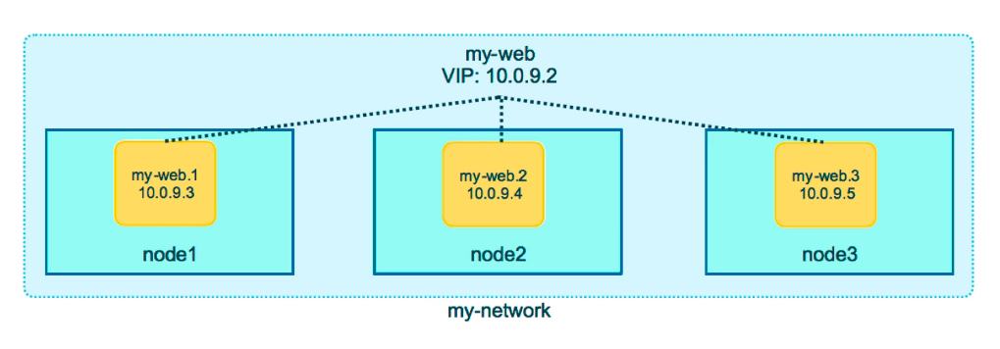
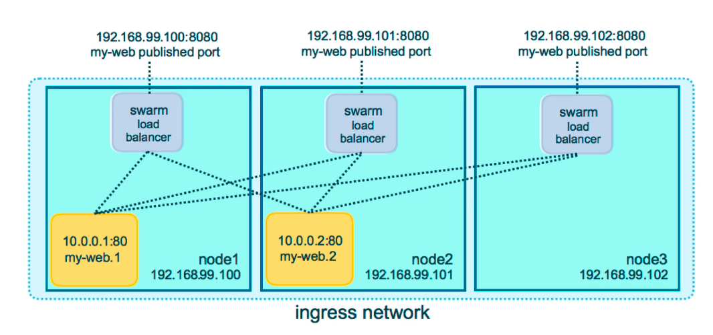

# Docker Swarm

Check if swarm enabled:

```shell
docker info
...
Swarm: inactive
...
```

Activate swarm:

```shell
docker swarm init
```

- Creates Root Signing Cert for swarm
- Issues cert for first manager node
- Creates join tokens
- Raft database is created to store root CA, configs and secrets
   - Encrypted on disk 
   - No need for another key/value system to hold orchestration secrets
   - Replicates log amongst managers via mutual TLS in _control plane_
  

`docker swarm` is a narrow-scope command, for joining / leaving swarms, promoting managers etc.

```shell
docker swarm --help
```

`docker node` command uses to manage nodes

Eg, show nodes:

```shell
docker node ls
ID                            HOSTNAME   STATUS    AVAILABILITY   MANAGER STATUS   ENGINE VERSION
se34h87576uup25vtwu4fo3c3 *   gsnsw      Ready     Active         Leader           20.10.6
```

`docker service` is the main command for doing things with swarm


Create a service:

```shell
docker service create alpine ping 8.8.8.8
rn1yfs2802a7tiynil1or8eqq <--- this is the service id
```

List services:

```shell
docker service ls
ID             NAME            MODE         REPLICAS   IMAGE           PORTS
rn1yfs2802a7   elastic_nobel   replicated   1/1        alpine:latest 
```

List tasks (service processes):

```shell
docker service ps elastic_nobel # <-- name or service id
ID             NAME              IMAGE           NODE      DESIRED STATE   CURRENT STATE           ERROR     PORTS
bunbot099yq2   elastic_nobel.1   alpine:latest   gsnsw     Running         Running 3 minutes ago
```

Scale service up:

```shell
docker service update elastic_nobel --replicas 3
...
docker service ls
ID             NAME            MODE         REPLICAS   IMAGE           PORTS
rn1yfs2802a7   elastic_nobel   replicated   3/3        alpine:latest
...
docker service ps elastic_nobel
ID             NAME              IMAGE           NODE      DESIRED STATE   CURRENT STATE                ERROR     PORTS
bunbot099yq2   elastic_nobel.1   alpine:latest   gsnsw     Running         Running 7 minutes ago                  
lkojtx8er6t7   elastic_nobel.2   alpine:latest   gsnsw     Running         Running about a minute ago             
ruib2ac070fg   elastic_nobel.3   alpine:latest   gsnsw     Running         Running about a minute ago 
```

Remove the service:

```shell
docker service rm elastic_nobel
```


## Swarm Cluster

Init swarm and advertise an IP accessible by other nodes

```shell
docker swarm init --advertise-addr [IP]
```

Then cut and paste the generated join command on the other nodes. To regenerate the join command can run 
`docker swarm join-token worker` or `docker swarm join-token manager`.

Swarm Visualiser, run this on one node

```shell
docker service create --name=viz --publish=8080:8080/tcp --constraint=node.role==manager --mount=type=bind,src=/var/run/docker.sock,dst=/var/run/docker.sock bretfisher/visualizer 
```

Then access on  `:8080` 


### Overlay Multi-Host Networking

- When creating a network choose `--driver overlay` so that containers can access each other as though on a VLAN.
- This is for container-to-container traffic inside a single swarm.
- Can enable full encryption between containers using IPSec (off by default).
- Each service can be added to zero or more overlay networks.

Example - Creating a drupal network:

```shell
docker network create --driver overlay mydrupal
docker network ls
docker service create --name psql --network mydrupal -e POSTGRES_PASSWORD=mypass postgres
docker service create --name drupal --network mydrupal -p 80:80 drupal
```

Once this is complete the drupal app will respond on any IP, even if it is only running on one node. This is because
of the _routing mesh_.

### Routing Mesh

- Routes ingress packets for a _Service_ to the appropriate _Task_ (container)
- Spans all nodes in swarm
- Uses IPVS from Linux Kernel
- Load balances Swarm Services across their Tasks
- Two ways this works:
   - Container-to-container in an Overlay network - puts a Virtual IP in front of a Service and acts like a load balancer
   - External traffic incoming to published ports is routed to the correct container and port 





- This is _stateless_ load balancing, ie cannot handle sessions
- Is layer 3 (IP/Port), not layer 4 (DNS)
- Both these limitations can be overcome using a reverse proxy, or Docker Enterprise Edition has 
  a builtin layer 4 web proxy.

