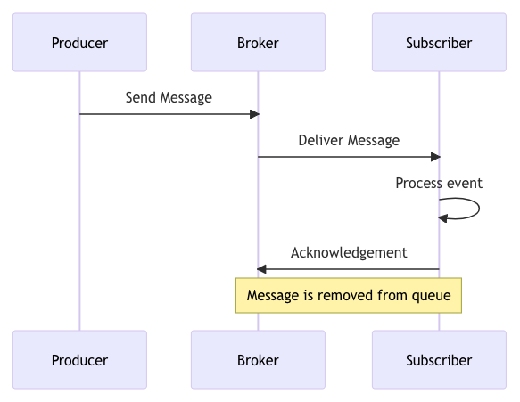
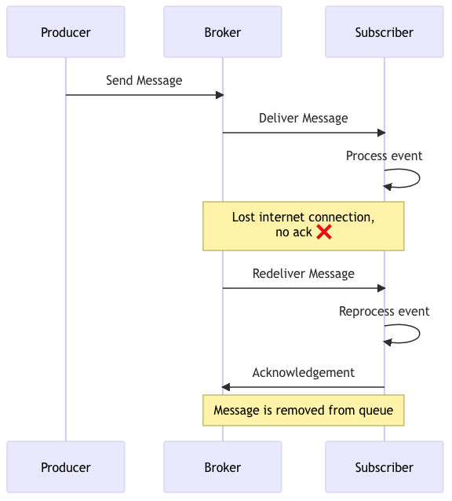
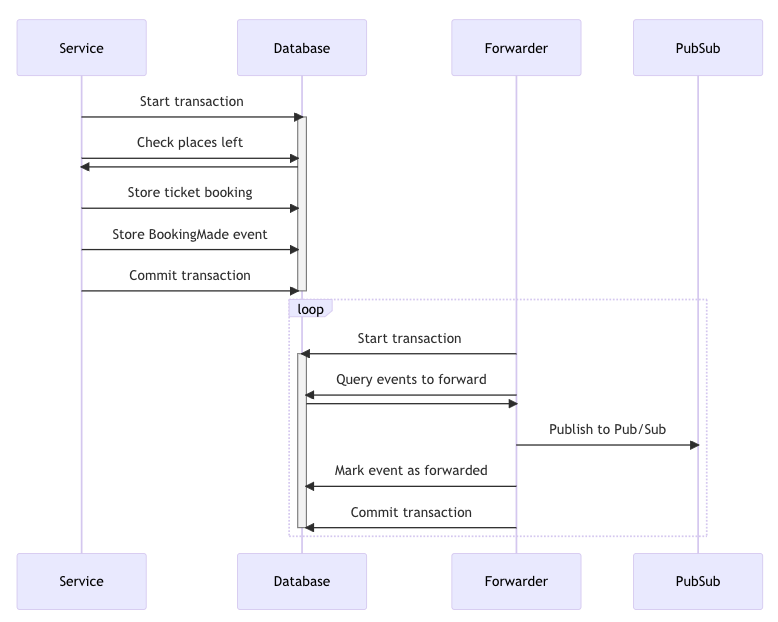

# Event-driven design

*Notes from ThreeDotes [Go event-driven course](https://academy.threedots.tech/trainings/go-event-driven)*

## Overview

Event-driven patterns are an *asynchronous* approach to building systems.

Traditional synchronous approaches involve processes that block flow while they wait for result:

```go
func TaskHandler() {
subTaskOne() // block, then 
subTaskTwo() // block, then
subTaskThree() // block until done
}
```

The design of an event-driven system is such that tasks can be setup such that they run independently and do not hold
each other up.

```go
func TaskHandler() {
go subTaskOne()
go subTaskTwo()
go subTaskThree()
}
```

Event-driven systems are composed of processes that communicate asynchronously using *messages*. These are sent via a
*message broker* which is an intermediary between message *publishers* and *subscribers*.

Published messages are appended to a *topic* and, generally, subscribers to the topic will receive the messages on a
*first-in, first-out (FIFO)* fashion.

In most systems, publishing a message will be a one-time process. Subscribers, however, will generally be an async
worker process that starts and waits for new messages on a particular topic.

Messages are delivered to a subscriber one-at-a-time so the subscriber lets the message broker know that a message has
been correctly processed with a *message acknowledgement* (*ack*).

If the subscriber fails to process the message it can sends a *negative acknowledgement (nack)* to the broker and the
message is returned to the queue for delivery at a later stage.

Often, there are multiple instances of a subscriber such as in distributed / containerised systems. To avoid messages
being processed by multiple subscribers the concept of a *consumer group* is used (aka *subscription*, *queue*).
Subscribers are allocated to a group and each message is delivered to a single subscriber within the group, in a
round-robin fashion. In other words, messages are delivered to the group.

## Events

In event-driven architecture and *event* is a just a message, however it represents something that has already happened,
ie an immutable fact. This is an important consideration in the way systems are designed.

For example, a synchronous approach may couple all relevant processes together:

```go
func PlaceOrder(order Order) {
SaveOrder(order)
NotifyUser(order)
NotifySales(order)
NotifyWarehouse(order)
GenerateInvoice(order)
ChargeCustomer(order)
}
```

By publishing an event, the scope of the func is reduced:

```go
func PlaceOrder(order Order) {
SaveOrder(order)          // <-- persist
PublishOrderPlaced(order) // <-- publish event and let other processes respond
}
```

This is still a form of coupling, but allows for more flexibility in the way the processes are designed.


> [!NOTE]
>
> **An event should be a verb in past tense stating that something happened**. When designing the event, think about
> what happened, not what needs to happen after. Otherwise, you may fall into the "passive-aggressive events" trap,
> where
> the publisher knows what happens after the event is published.

### Marshalling

Event payloads are published as raw bytes so data structures must be serialised before they can be published.

JSON is a common message format but can also use [Protocol Buffers](https://protobuf.dev)
or [Avro](https://avro.apache.org).

## Components of an event-driven system

Note: The following descriptions are based on the [Watermill CQRS component](https://watermill.io/docs/cqrs/)

- **Event Bus**: this component hides the complexity of publishing events behind a simple interface.
- **Event Processor**: this component is responsible for subscribing to events and processing them.
- **Event Handler**: this component is responsible for handling events - ie takes an event as an argument and returns an
  error.

The use of the Watermill CQRS package abstracts away a lot of the boilerplate for setting up subscriptions and
event handlers:

- Publish messages using the EventBus, not the Publisher directly.
- Replace the Router handlers with an EventProcessor and EventHandlers.
- Should not do any JSON marshaling yourself - use the JSONMarshaler from Watermill for both EventBus and
  EventProcessor.
- Don't create messages manually to send them - just pass the event struct to EventBus's Publish.
- Should have no Subscriber created manually. Instead, they are created within the SubscriberConstructor in the
  EventProcessor.
- Use the handler name as the consumer group.

## Idempotent event handlers

An idempotent function is one that can be called multiple times with the same input and produce the same output.

In an event-driven system, it is important that event handlers are idempotent. This is because messages can be delivered
more than once due to network issues, system failures, etc.

For example, a working system flow:



A system flow with a duplicate message:



Don't want to process the same event twice, so event handlers should be _idempotent_.

This can also be described as _at least once_ delivery. That is, the message broker guarantees that the message will be
delivered at least once, but it may be delivered more than once.

_Duplicator middleware_ deliberately processes each message twice so it can be used test / ensure the the idempotency
of handlers.

Another way this can be handled is to expect an `Idempotency-Key` header in http requests to the service,
and to propagate this key to the event handler via the message header. The event handler can then use this key to
determine if the event has already been processed.

## Outbox pattern

This is a design pattern used in event-driven systems that ensures reliable message delivery and consistency between the
data store and the messaging system.

The pattern involves the addition of an `outbox` table in the database that stores messages that need to be sent.
Database updates are performed as a transaction with changes committed to relevant tables as well as the resulting
message being written to the `outbox`.

This means a successful transaction will always result in a message being sent. Even if the publisher or message service
is disrupted, the message will be sent when the system is back online.

A separate process is responsible for reading messages from the `outbox` and sending them to the message broker. For
example, Debezium can be used to monitor the database for changes and send messages to the message broker. This process
is often referred to as a "message dispatcher", "message relay" or "message forwarder".




