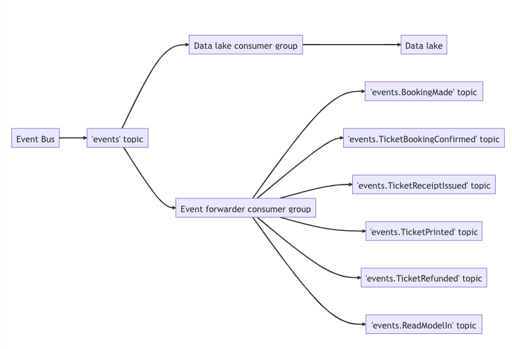
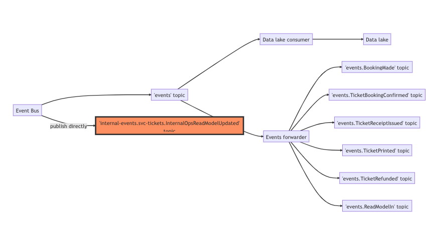
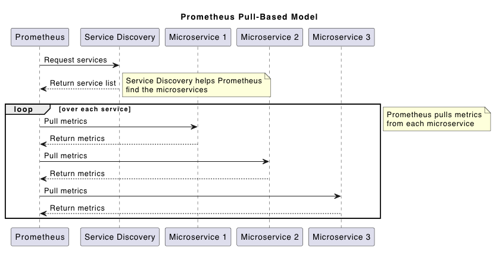

# Event-driven design

*Notes from ThreeDotes [Go event-driven course](https://academy.threedots.tech/trainings/go-event-driven)*

## Overview

Event-driven patterns are an *asynchronous* approach to building systems.

Traditional synchronous approaches involve processes that block flow while they wait for result:

```go
func TaskHandler() {
subTaskOne() // block, then 
subTaskTwo() // block, then
subTaskThree() // block until done
}
```

The design of an event-driven system is such that tasks can be setup such that they run independently and do not hold
each other up.

```go
func TaskHandler() {
go subTaskOne()
go subTaskTwo()
go subTaskThree()
}
```

Event-driven systems are composed of processes that communicate asynchronously using *messages*. These are sent via a
*message broker* which is an intermediary between message *publishers* and *subscribers*.

Published messages are appended to a *topic* and, generally, subscribers to the topic will receive the messages on a
*first-in, first-out (FIFO)* fashion.

In most systems, publishing a message will be a one-time process. Subscribers, however, will generally be an async
worker process that starts and waits for new messages on a particular topic.

Messages are delivered to a subscriber one-at-a-time so the subscriber lets the message broker know that a message has
been correctly processed with a *message acknowledgement* (*ack*).

If the subscriber fails to process the message it can sends a *negative acknowledgement (nack)* to the broker and the
message is returned to the queue for delivery at a later stage.

Often, there are multiple instances of a subscriber such as in distributed / containerised systems. To avoid messages
being processed by multiple subscribers the concept of a *consumer group* is used (aka *subscription*, *queue*).
Subscribers are allocated to a group and each message is delivered to a single subscriber within the group, in a
round-robin fashion. In other words, messages are delivered to the group.

## Events

In event-driven architecture and *event* is a just a message, however it represents something that has already happened,
ie an immutable fact. This is an important consideration in the way systems are designed.

For example, a synchronous approach may couple all relevant processes together:

```go
func PlaceOrder(order Order) {
SaveOrder(order)
NotifyUser(order)
NotifySales(order)
NotifyWarehouse(order)
GenerateInvoice(order)
ChargeCustomer(order)
}
```

By publishing an event, the scope of the func is reduced:

```go
func PlaceOrder(order Order) {
SaveOrder(order)          // <-- persist
PublishOrderPlaced(order) // <-- publish event and let other processes respond
}
```

This is still a form of coupling, but allows for more flexibility in the way the processes are designed.


> [!NOTE]
>
> **An event should be a verb in past tense stating that something happened**. When designing the event, think about
> what happened, not what needs to happen after. Otherwise, you may fall into the "passive-aggressive events" trap,
> where
> the publisher knows what happens after the event is published.

### Marshalling

Event payloads are published as raw bytes so data structures must be serialised before they can be published.

JSON is a common message format but can also use [Protocol Buffers](https://protobuf.dev)
or [Avro](https://avro.apache.org).

## Components of an event-driven system

Note: The following descriptions are based on the [Watermill CQRS component](https://watermill.io/docs/cqrs/)

- **Event Bus**: this component hides the complexity of publishing events behind a simple interface.
- **Event Processor**: this component is responsible for subscribing to events and processing them.
- **Event Handler**: this component is responsible for handling events - ie takes an event as an argument and returns an
  error.

The use of the Watermill CQRS package abstracts away a lot of the boilerplate for setting up subscriptions and
event handlers:

- Publish messages using the EventBus, not the Publisher directly.
- Replace the Router handlers with an EventProcessor and EventHandlers.
- Should not do any JSON marshaling yourself - use the JSONMarshaler from Watermill for both EventBus and
  EventProcessor.
- Don't create messages manually to send them - just pass the event struct to EventBus's Publish.
- Should have no Subscriber created manually. Instead, they are created within the SubscriberConstructor in the
  EventProcessor.
- Use the handler name as the consumer group.

## Idempotent event handlers

An idempotent function is one that can be called multiple times with the same input and produce the same output.

In an event-driven system, it is important that event handlers are idempotent. This is because messages can be delivered
more than once due to network issues, system failures, etc.

For example, a working system flow:


A system flow with a duplicate message:


Don't want to process the same event twice, so event handlers should be _idempotent_.

This can also be described as _at least once_ delivery. That is, the message broker guarantees that the message will be
delivered at least once, but it may be delivered more than once.

_Duplicator middleware_ deliberately processes each message twice so it can be used test / ensure the the idempotency
of handlers.

Another way this can be handled is to expect an `Idempotency-Key` header in http requests to the service,
and to propagate this key to the event handler via the message header. The event handler can then use this key to
determine if the event has already been processed.

## Outbox pattern

This is a design pattern used in event-driven systems that ensures reliable message delivery and consistency between the
data store and the messaging system.

The pattern involves the addition of an `outbox` table in the database that stores messages that need to be sent.
Database updates are performed as a transaction with changes committed to relevant tables as well as the resulting
message being written to the `outbox`.

This means a successful transaction will always result in a message being sent. Even if the publisher or message service
is disrupted, the message will be sent when the system is back online.

A separate process is responsible for reading messages from the `outbox` and sending them to the message broker. For
example, Debezium can be used to monitor the database for changes and send messages to the message broker. This process
is often referred to as a "message dispatcher", "message relay" or "message forwarder".


## Commands vs Events

In general terms and even-driven system should _not use passive-aggressive events_. That is, events that are published
with the expectation that something will happen after the event is published. Events should be used to describe things
that have happened and they should represent immutable facts.

However, there are cases where it is useful to use events to trigger actions. _Commands_ are events that are published
with the expectation that something will happen after the event and where a synchronous response is not required.
Generally speaking, commands are intended to be consumed by only one consumer and as such, command monitoring may be set
up differently from event monitoring.

Command Query Responsibility Segregation (CQRS) is a pattern that separates the read and write sides of an application.
In CQRS, commands are used to update the state of the system and events are used to notify other parts of the system
that the state has changed. CQRS does not necessarily require asynchronous communication, but it is often used in
event-driven systems.

## Read Models

In CQRS, the read side of the application is responsible for querying the data store and returning the data to the
client. The read side is often implemented using a read model, which is a denormalized view of the data that is
optimized for querying. That is, the data is stored in a format that is easy to query and does not require complex
transformations before it can be returned to the client.

The read model is updated by event handlers that listen for events on the write side of the application. When an event
is received, the event handler updates the read model to reflect the changes made by the event.

The read model is often stored in a separate data store from the write model, such as a relational database or a
NoSQL database. This allows the read model to be optimized for querying, while the write model can be optimized for
writing.

Read models provide teams with more autonomy in how they store and query data. They can be optimized for specific
use cases and can be updated independently of the write model. This can lead to better performance and scalability,
as well as improved developer productivity.

The implementation of a read model should have little, if any, business rules validation or related logic. In short, a
read model is about gathering all the required data and optimising it for reading.

One possible downside to a read model is the fact that the data is _eventually consistent_. Event if it is only a few
milliseconds behind the write model, there is a chance that the data returned to the client is not up-to-date. So this
needs to be taken into account when deciding on the design of the system.

## Message order

In an event-driven system, messages are delivered to subscribers in the order they are published. However, there are
cases where the order of messages is important. The way this is handled depends on numerous factors but it needs to
be considered when designing an event-driven system.

### Single topic

The simplest approach is to use a single topic for all messages. This guarantees that messages are delivered in the
order they are published. However, this can lead to performance issues if there are a large number of messages being
published.

With a single topic the handlers need to filter out the messages they are interested in. This can be done by adding
metadata to the message, such as a type or a key, and then filtering based on that metadata.

> Note: The `watermill` package `CQRS` component has an `EventGroupProcessor` which manages "groups" of handlers.
> By setting the `AckOnUnknownEvent` option to `true`, the processor will acknowledge messages that are not handled by
> any of the handlers in the group.

### Partition per entity

Another approach is to use a separate topic for each entity. This guarantees that messages for a single entity are
delivered in the order they are published. This approach is more scalable than using a single topic, but it can be
more complex to implement.

An "entity" in this context means a group of related events that concern the same model or business concept. For
example, we could have an `events.orders` topic for all events related to orders.

This is still not ideal, though. First of all, a single failed event can stop updates for all other entities. For
example, if one `OrderPaid` event fails, all subsequent orders must wait until it's correctly handled.

The second issue is that we can't easily scale the processing of events. Since the handlers don't know which entity the
event belongs to, they can process only one message at a time if we want to keep things in order.

We can improve this approach by using partitions. Some Pub/Subs support explicit metadata for messages that makes it
possible to scale processing them while keeping them in order. This can be called an ordering key, partition key, or
something similar.

Kafka supports partitions. A partition is a way to split a topic into multiple queues. Each partition is a separate
queue, and Kafka guarantees that the messages within a partition will be delivered in order.

The key point is that one partition is always assigned to one subscriber. The crucial step is to set a partition key for
each message: a string that uniquely identifies the entity (for example, order ID). Kafka uses a hashing algorithm to
determine which partition the message should go to. This means that messages from a particular entity will always go to
the same partition, and therefore will be processed by the same subscriber.

### Versioning entities

Another approach is to version entities. This means that each entity has a version number, and messages are processed
based on the version number. If a message is received with a version number that is higher than the current version of
the entity, it is returned to the queue to be processed later. Once processed the version number of the entity must be
updated.

### Independent updates

In some cases it may be possible to have specified events update only one part of a particular entity. This may be more
useful in read models. For example, if the only thing that can update the `paid_at` field of an order is the `OrderPaid`
event, then the order of this event's publication won't matter because there are no other ways to update this field.

## Data lakes

A data lake is a centralized repository that allows you to store all your structured and unstructured data at any scale.
For event-driven systems a data lake is an ideal way to store all the events that have been published in order to
replay them.

For example, we may want to rebuild a read model and need to replay all of the events in order to do so.

The events should be stored in raw form so that they can be replayed in the same order they were published, and they
should be _read-only_ as events represent immutable facts that happened in the system.

At scale technologies like Google Cloud BigQuery and Amazon Redshift can be considered. At smaller scale a simple
PostgreSQL database may be sufficient.

To ensure all events are captured and stored in the data lake a simple strategy is to publish all events to a single
topic and have a dedicated consumer group that writes the events to the data lake, and a second consumer group that is
responsible for forwarding the events to the more specific topics for processing.

For example:


The event forwarding might be in the same service, or separate services.

## Versioning events

Emitting events to a pub/sub that anyone can access establishes a contract which makes it important that the events
do not change.

One approach to backward compatibility is to add new fields to the event payload and keep the old fields - in a similar
approach to protobuf messages. This is effective and straightforward but can lead to the accumulation of a lot of fields
in the event payload over time.

Another approach is to version the events. This means that when an event changes, a new version of the event is created
with a new name. This allows the old version of the event to continue to be processed by existing consumers, while new
consumers can be updated to process the new version of the event. In some case it may be viable to migrate older events
to the new version.

## Internal events

In some cases events are very specific to a particular team or system so can be flagged as such. In these cases the
events
may not need to be published to a data lake and can be changed as required.

An event with an 'internal' flag would be published directly without going through the general `events` topic and
then being forwarded onto the require topic and copied to the data lake.

For example:



## Observability

Basic monitoring in synchronous systems is straightforward - we can log errors, measure response times, etc. However, in
event-driven systems, things are more complex. Event-driven systems are more resilient and scalable, but they are also
more difficult to monitor.

Prometheus is an industry standard for storing exported metrics for services. It is a pull-based system, meaning that
services expose an HTTP endpoint that Prometheus scrapes to collect metrics. It is a time-series database that stores
metrics in a time-series format, making it easy to query and visualize the data.



In pull-based systems, your service is responsible for initial metrics aggregation and exposing them on some endpoint.
You can easily debug such a service with curl `[host:port]/metrics` and see if it works. The response from the endpoint
looks more or less like:

```shell
# HELP http_requests_total The total number of HTTP requests.
# TYPE http_requests_total counter
http_requests_total{method="post",code="200"} 1027
http_requests_total{method="post",code="400"} 3

# HELP http_request_duration_seconds A histogram of request duration.
# TYPE http_request_duration_seconds histogram
http_request_duration_seconds_bucket{le="0.05"} 1000
http_request_duration_seconds_bucket{le="0.1"} 1500
http_request_duration_seconds_bucket{le="0.2"} 2000
http_request_duration_seconds_bucket{le="0.5"} 2500
http_request_duration_seconds_bucket{le="1"} 3000
http_request_duration_seconds_bucket{le="+Inf"} 3500
http_request_duration_seconds_sum 5000
http_request_duration_seconds_count 3500
```

There are libraries available for Go that can help with this, such as `prometheus` and `promhttp`.

Prometheus supports multiple metric types:

- **Counter**: Can be only increased or zeroed; good for representing numbers of requests, errors, or other events.
- **Gauge**: Can go up or down; good for representing the current state of something, like the number of active
  connections, memory usage, etc.
- **Histogram**: Counts the number of events that happened in a given time period; good for representing request
  duration,
  response size, etc.
- **Summary**: Similar to histogram but also calculates configurable quantiles; good for representing request duration,
  response size, etc.

To learn more about these, check the [Prometheus documentation](https://prometheus.io/docs/concepts/metric_types/).

Each metric is identified by a _name_ and a set of key-value pairs called _labels_. Labels are used to differentiate
between different instances of the same metric. For example, you can have a `http_requests_total` metric with labels
`method` and `code` to differentiate between different types of requests.

```shell
http_requests_total{method="post",code="200"} 1027
```

This is a metric with the name `http_requests_total`, labels `method` and `code`, and value `1027`.

Prometheus metrics names have a _recommended_ naming convention. The single-word prefix of the metrics should represent
the service or domain to which it belongs to.

For example, if you have a metric specific to a tickets service, it should have the prefix `tickets_`. If you have a
more general metric that is not specific to any service, it can have a prefix related to its domain, like `http`,
`messages`, etc.

The suffix of the metric should describe the unit of the metric in plural form. For example: `seconds`, `bytes`,
`requests`, `seconds_total`, `total`, etc.

You can learn more about the naming in
the [Prometheus "naming" documentation](https://prometheus.io/docs/practices/naming/).

Note: The Prometheus handler is implemented in HTTP standard library format. If you are using echo, you need to wrap it
with `echo.WrapHandler`.

Grafana is a visualization tool that can be used to create dashboards that display metrics collected by Prometheus.

## Tracing

Tracing is a way to monitor the flow of requests through a system. It allows you to see how long each part of the
request takes and where the bottlenecks are. Tracing is especially useful in distributed systems, where requests can
pass through multiple services.

OpenTelemetry is an open-source project that provides a set of APIs, libraries, agents, and instrumentation to enable
observability in your applications. OpenTelemetry also supports metrics and logging, in addition to tracing, however
it isn't as mature as Prometheus and Grafana.

Some important terms related to tracing:

- **Span**: Represents a unit of work done in a system, is a single operation:
    - Span ID:
    - Operation name
    - Start and end tiems
    - Key-value attributes
    - Parent span ID
    - Trace ID
- **Trace**: A collection of spans that represent a single request through a system,ie with the same trace ID.

Typical any _long_ operations can be represented as a span, eg:

- HTTP requests
- Database queries
- Processing of messages
- External API calls

An _exporter_ is a component that sends the collected traces to a backend. The backend can be a tracing system like
Jaeger, AWS X-Ray, GCP Stack Driver, or a monitoring system like Prometheus.

A _propagator_ is a component that is responsible for serialising/de-serialising the trace context between services.
The trace context is a set of headers that are added to the request to carry the trace information.

_Sampling_ is a technique used to reduce the number of spans that are collected. This is important because collecting
every span can be expensive and can lead to performance issues. There are different sampling strategies, such as
probabilistic sampling, rate limiting, and tail-based sampling.

### Propagating trace context

There are multiple standards that can be used for propagating traces. OpenTelemetry recommends the use of the
[W3C Trace Context specification](https://www.w3.org/TR/trace-context/).

To propagate a trace, the trace ID and parent span ID are serialized and passed to the next service. The _Trace Context_
standard defines a format that generates values, like: `00-0af7651916cd43dd8448eb211c80319c-b7ad6b7169203331-01`. This
value is subsequently stored in the request header or message metadata with the name `traceparent`.

When the message or request is handled, the value is extracted from the header and deserialized. Then the new span is
created with the same trace ID and parent span ID.

#### Propagating trace context in HTTP

In HTTP, the trace context is stored in the `traceparent` header. The `tracestate` header can also be used to store
additional trace context.

To propagate trace context in an HTTP request, there are two places that need to be considered:

- Sending the request (HTTP client): Extract the trace ID and parent span ID from the context and store them in the
  `traceparent` header.
- Receiving the request (HTTP middleware): Extract the trace ID and parent span from the `traceparent` header and
  store them to the context of the *http.Request, so all HTTP handlers will be part of the same trace.

#### Propagating trace context in event systems

In event-driven systems, the trace context can be stored in the message metadata. The idea is similar to HTTP, ie
involves the points at which a message is _published_ and _received_.

- Publishing the message (Publisher): Extract the trace ID and parent span ID from the context and store in message
  metadata `traceparent`.
- Receive the request (message router middleware): Extract the trace ID and parent span from `traceparent` metadata and
  store in the context of the `*message.Message`, so all message handlers will be part of the same trace. 


