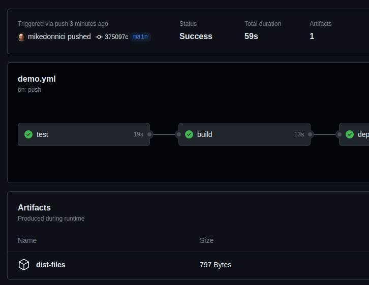

# Github actions

- workflow automation
    - continuous integration - continuous delivery
    - code and repository management

## Key components

- *repository*
    - *workflows*
        - triggered by events
        - contain one or more jobs
            - *jobs*
                - define a runner (execution environment) - _every job has its own runner_
                - can be conditional
                - run in parallel by default, can be run sequentially
                - contain one or more steps
                - *steps*
                    - can be conditional
                    - run sequentially
                    - execute a shell script (command) or action
                    - *actions*
                        - own or third party

## `run` commands

- A step can run a shell command using the `run` keyword
- Multiple or multiline commands use the pipe symbol

```yaml
steps:
  name: Step one
  run: |
    echo "one"
    echo "two"
    echo "three"
```

## `uses` action `with` configuration

- a step can run an action with the `uses` keyword
- configuration (key-val pairs) for the action is provided using the `with` keyword
- *note: configuration keys must be supported by the action or it will fail*

```yaml
steps:
  name: Step two
  uses: some-action@v1
  with:
    key1: val1
    key2: val2
```

## Expressions and context objects

- Enables access to _metadata_ such as env vars
- Available metadata is collectively referred to as *context*
- Access context vars using the _expression_ syntax: `${{ }}`
- *Expressions* are combinations of _literals_, context references and _functions_
- ref:
    - https://docs.github.com/en/actions/learn-github-actions/contexts
    - https://docs.github.com/en/actions/learn-github-actions/expressions

```yaml
name: output values
on: workflow_dispatch
jobs:
  output:
    runs-on: ubuntu-latest
    steps:
      - name: Output github key context values
        run: echo "${{ toJSON(github) }}"
```

---

## Event activity types and filters for triggering workflows

- ref: https://docs.github.com/en/actions/using-workflows/events-that-trigger-workflows
- provides fine-grained control for workflow execution

- example _activity type_:

```yaml
on:
  pull_request:
    types: # <-- list of types
      - opened  # <-- activity type trigger
```

- example _event filter_

```yaml
on:
  push:
    branches: # <-- list of target branches
      - main
      - 'dev-*'
      - 'feat/**'
    paths-ignore: # <-- trigger based on file path filter
      - '.github/workflows/*'
```

*Note:* Pull requests based on forks do not automatically trigger workflows _for first time contributors_ - they must be
approved by the repo owner. Once a contributor has had a PR approved, subsequent PRs will trigger the workflow
automatically. Collaborators are considered to be trusted users so do not have this restriction.

## Cancelling and skipping workflows

- by default workflows get cancelled if a job fail, or can manually cancel workflows in UI
- [skipping workflow runs](https://docs.github.com/en/actions/managing-workflow-runs/skipping-workflow-runs) can be
  achieved by adding any of these strings to the commit messages:
    - `[skip ci]`
    - `[ci skip]`
    - `[no ci]`
    - `[skip actions]`
    - `[actions skip]`
    - or, end commit message with 2 empty lines followed by `skip-checks:true`
- note that the skip directives only apply to `push` and `pull_request` events

## Job artifacts

- _Artifacts_ are generated output assets of a job that are distributed, eg a package, binary, web files
- Artifacts can be used in subsequent jobs or dowloaded from github ui on actions summary page
- See:
    - https://github.com/actions/upload-artifact
    - https://github.com/actions/download-artifact

```yaml
- name: upload artifacts
  uses: actions/upload-artifact@v3
  with:
    name: dist-files # arbitrarty name
    path: |          # one or more artifact to be uploaded
      dist
      foo
```



- Example: `dist` folder uploaded from `build` job dowloaded in `deploy` job

```yaml
name: Deploy website
on:
  push:
    branches:
      - main
jobs:
  test:
    runs-on: ubuntu-latest
    steps:
      - name: Get code
        uses: actions/checkout@v3
      - name: Install dependencies
        run: npm ci
      - name: Lint code
        run: npm run lint
      - name: Test code
        run: npm run test
  build:
    needs: test
    runs-on: ubuntu-latest
    outputs:
      script-file: # arbitrary name
    steps:
      - name: Get code
        uses: actions/checkout@v3
      - name: Install dependencies
        run: npm ci
      - name: Build website
        run: npm run build
      - name: publish js file name
        run: find dist/assets/*.js -type -execdir echo 'script-file={}' >> $GITHUB_OUTPUT ';'
      - name: upload artifacts
        uses: actions/upload-artifact@v3  # action
        with:
          name: dist-files                # reference name
          path: dist                      # artifact
  deploy:
    needs: build  # need this so dist files are ready before this job runs
    runs-on: ubuntu-latest
    steps:
      - name: Download artifacts
        uses: actions/download-artifact@v3
        with:
          name: dist-files    # matches name from above
      - name: List contents
        run: ls               # note shows contents of dist folder, not dist itself
      - name: Deploy
        run: echo "Deploying..."
```

## Job outputs

- Simple values that can be used in subsequent jobs, eg filename, hash, dates
- define `outputs` at top-level of job
- access `steps` context using the step `id`
- output key-value pairs are sent to a special file with `>> $GITHUB_OUTPUT`
- note: older syntax for setting values `::set-output name=value-name::'some value'`
- access outputs in subsequent jobs with via
  a [context](https://docs.github.com/en/actions/learn-github-actions/contexts)
- the [`needs`](https://docs.github.com/en/actions/learn-github-actions/contexts#needs-context) context is good as it
  contains all outputs of jobs that area direct dependency of the current job.

```yaml
jobs:
  job-one:
    runs-on: ubuntu-latest
    outputs:
      my-output: ${{ steps.step-id.value-name }}
    steps:
      # ...
      - name: output step
        id: step-id
        run: echo 'value-name="some value"' >> $GITHUB_OUTPUT
  job-two: 
    needs: job-one
    runs-on: ubuntu-latest 
    steps: 
      # ... 
      - name: output value
        run: echo "${{ needs.job-one.outputs.my-output }}"
    
```

## Dependency caching

- Often installation of dependencies takes time and caching can make things faster
- Files and folders can be cached across jobs using [`actions/cache`](https://docs.github.com/en/actions/using-workflows/caching-dependencies-to-speed-up-workflows)
- Caching step is added _before_ the step that produces the files, eg:

```yaml
jobs:
  test:
    runs-on: ubuntu-latest
    steps:
      - name: get code
        uses: actions/checkout@v3
      - name: cache dependencies
        uses: actions/cache@v3
        with: 
          path: ~/.npm              # path to cache
          key: deps-node-modules-${{ hashFiles('**/package-lock.json') }} # key with hash
      - name: install dependencies  # generates files
        run: npm ci
      # ...
```

- the hash key in the example will change if _any_ `package-lock.json` file changes
- this invalidates the cache and will force re-installation of the dependencies 
- see https://docs.github.com/en/actions/using-workflows/caching-dependencies-to-speed-up-workflows for specific setups for different languages
- *note*: the caching step must be added to all jobs where the same task is performed and the cache is required
- caching is central and globally available to all jobs and across separate workflow executions


