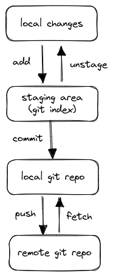

# Git

Refs:

- [ProGit](https://git-scm.com/book/en/v2)
- [Git Tutorial](https://git-scm.com/docs/gittutorial)
- [Git Cheat Sheet](https://training.github.com/downloads/github-git-cheat-sheet.pdf)
- [Learn Git the Hard Way](https://leanpub.com/learngitthehardway/read_full)

## Overview

- git is a _distributed_ (decentralised) version control system (DVCS)
- all copies of the repository can push and pull changes, they are all _equal_
- a branch is a copy of a set of changes in the repository, at a point in time,
  that can be worked on independently of other branches.
- _upstream_ is the repository from which the code is taken, _downstream_ refers
  to the repository that receives the code (from _upstream).
- convention for branch arrows to point to previous commit, ie _backwards_ in
  time.

### Four phases of git content



## Basics

- Initialise a git repository
- creates the `.git` directory

```bash
$ git init
$ ls .git
branches  config  description  HEAD  hooks  info  objects  refs
```

### `HEAD`

- A file that points to the current branch or commit ID you are _on_

```bash
$ cat .git/HEAD
ref: refs/heads/main
```

### `config`

- plain text file containing local repository configuration

```bash
$ cat .git/config
[core]
    repositoryformatversion = 0
    filemode = true
    bare = false
    logallrefupdates = true
```

### `git log`

- shows the commit history

```bash
$ git log
fatal: your current branch 'main' does not have any commits yet
```

### `git status`

- shows the status of the working tree

```bash
$ git status
On branch main
No commits yet
nothing to commit (create/copy files and use "git add" to track)
```

### `git add`

- adds file(s) to the staging area (ie _local index_)
- once added, git tracks changes for these files
- does not alter the history until committed

```bash
$ git add main.go
```

### `git commit`

- commit staged files to the local repository
- takes a snapshot of all changes at the current point in time

```bash
$ git commit -m "Initial commit"
[main (root-commit) 45bc998] Initial
 1 file changed, 0 insertions(+), 0 deletions(-)
 create mode 100644 main.go
```

### `git log`

- shows the commit history

```bash
$ git log
commit 45bc998360165a53ec212a4cc00029e98faf199b (HEAD -> main)
Author: Mike Donnici <michael.donnici@gmail.com>
Date:   Mon Feb 13 07:51:23 2023 +1100

    Initial commit
```    

### `git diff`

- Shows the difference between the working tree and the staging area

```bash
$ git diff
diff --git a/main.go b/main.go
index 2e222c2..3c8f88f 100644
--- a/main.go
+++ b/main.go
@@ -1,5 +1,5 @@
 package main
 
 func main() {
-       fmt.Println("hello")
+       fmt.Println("bye")
 }
```

## Cloning a repository

- `git clone`
    - creates a local copy of a repository
    - is a combination of `git init` and `git pull`

```bash
$ git clone https://github.com/8o8/chunky-monkey.git
```

- `.git/config` contains the remote repository URL
- the _remote_ is named `origin` by default

```bash
$ grep -A2 'remote "origin"' .git/config 
[remote "origin"]
        url = git@github.com:8o8/chunky-monkey.git
        fetch = +refs/heads/*:refs/remotes/origin/*
```

## Recovering repo state with `git reset`

- `git reset` (default flag is `--mixed`) takes changes out of staging/index
  but keeps them in the working directory.
- `git reset --hard` takes changes out of staging/index and working directory,
  so working changes are lost.

## Branches

- branches are snapshot copies of the repository at a point in time
- `git branch <branch-name>` creates a new branch
- `git checkout <branch-name>` switches to the branch
- `git checkout -b <branch-name>` creates a new branch and switches to it

```bash
$ git branch
* main
$ git branch feature
$ git branch
  feature
* main
$ git checkout feature
Switched to branch 'feature'
$ git branch
* feature
  main
```  

- Note: detached HEAD state occurs when you checkout a commit ID instead of a
  branch -
  ie the HEAD is not pointing to a branch.

## Tags

- a branch is just a pointer to the end of a line of changes
- a tag is a pointer to a single change
- ie, tags are the same as branches, but they have no history
- tags are used to mark a specific point in the repository history
- `git tag <tag-name>` creates a new tag
- `git tag` lists all tags

```bash
$ git tag
$ git tag v1.0
$ git tag
v1.0
```

## Merging

- `git merge <branch-name>` merges the changes from the specified branch into
  the current branch
- it locates the _first common ancestor_ of both branches and applies all the
  changes from the branch being _merged in_ to the current branch, in one go.
- a new commit is automatically created to record the merge
- a _merge conflict_ occurs when the same line in a file has been changed in
  both branches. The file will contain conflict markers to indicate the start
  and
  end of the conflict, eg:

```shell
<<<<<<< HEAD
    return n * n
=======
    return (n+2) * n
>>>>>>> feature
```

- the conflict must be resolved manually before the merge can be completed
- once the conflict is resolved the file can be added to the staging area and
  committed to complete the merge

## Switch and Restore

`git switch` and `git restore` are new commands that are used in place of the
overloaded `git checkout`.

- `git switch` is used to switch branches

```shell
$ git switch feat # same as git checkout feat
$ git switch -c feat # same as git checkout -b feat
$ git switch -c feat1 feat2 # create feat2 from feat1 and switch to it
$ git switch - # same as git checkout - (switch to previous branch)
```

- `git restore` is used to restore files to a previous commit state

```shell
$ git restore main.go # same as git checkout -- main.go
```


 

[UP TO p40]
---

Older notes below - merge into above

## Diffing files

- Using `diff`

```bash
$ diff file1.py file2.py 
2c2,3 <-- indicates line format and change (c)
<     return n * n
---
>     """A comment"""
>     return (n+2) * n
```

- Using `diff -u` (unified format)

```bash
 $ diff -u file1.py file2.py 
--- file1.py    2021-01-26 12:29:54.881984323 +1100
+++ file2.py    2021-01-26 12:34:41.767966975 +1100
@@ -1,2 +1,4 @@
 def foo(n):
-    return n * n
+    return (n+2) * n
+
+print("Add a new line")
```

- Other diff tools include `kdiff3`, `meld`, `vimdiff`, `wdiff`
- Create a diff file:

```bash
$ diff -u file1.py file2.py > changes.diff
```

- Apply a diff file using `patch`

```bash
$ patch file1.py < changes.diff 
patching file file1.py
```

Version Control Systems (VCS) use this approach under the hood.

## Config

```bash
$ git config --global user.email "michael@mesa.net.au"
$ git config --global user.name "Mike Donnici"
```

`.gitconfig`

```
[user]
	email = michael@mesa.net.au
	name = Mike Donnici
[core]
	editor = vim
[alias]
	last = log -1 HEAD
	ll = log --abbrev-commit --oneline --decorate --graph --all
	unstage = reset HEAD --
```

---

## Structure and Basic Workflow

- `.git` directory contains configuration and the complete change history of
  all _tracked_ files
- The **working tree** contains the _current_ state of the project
- The **staging area** contains changes marked for the next _commit_
- _Tracked_ files can be in 3 states:
    - **Modified** - the file has been changed
    - **Staged** - the change will be added to next commit
    - **Committed** - a snapshot of the _staged_ changes has been recorded
- Basic workflow:

```bash
$ git init
$ git config -l # check identity for commits
$ git status
$ git add 
$ git commit
```

## Commit message

Refs:

- <https://chris.beams.io/posts/git-commit/>
- <https://gist.github.com/robertpainsi/b632364184e70900af4ab688decf6f53>

### Guidelines

1. Limit the subject line to 50 characters
1. Capitalize the subject line
1. Do not end the subject line with a period
1. Use the imperative mood in the subject line
1. Separate subject from body with a blank line
1. Wrap the body at 72 characters
1. Use the body to explain what and why vs. how

### Example

```
Summarize changes in around 50 characters or less

Write your commit message in the imperative: "Fix bug" and not "Fixed
bug" or "Fixes bug." This convention matches up with commit messages
generated by commands like git merge and git revert.

More detailed explanatory text, if necessary. Wrap it to about 72
characters or so. In some contexts, the first line is treated as the
subject of the commit and the rest of the text as the body. The
blank line separating the summary from the body is critical (unless
you omit the body entirely).

Explain the problem that this commit is solving. Focus on why you
are making this change as opposed to how (the code explains that).
Are there side effects or other unintuitive consequences of this
change? Here's the place to explain them.

Further paragraphs come after blank lines.

 - Bullet points are okay, too

 - Typically a hyphen or asterisk is used for the bullet, preceded
   by a single space, with blank lines in between, but conventions
   vary here

If you use an issue tracker, put references to them at the bottom,
like this:

Resolves: #123
See also: #456, #789
```

## File management

### `git commit -a`

- Stage and commit tracked files in one step
- Does not `add` files

### `git log -p`

- _patch_ flag with similar output to `diff -u`

### `git show [commit id]`

- Shows the diff for the specified commit
- `git show --stat [commit id]` shows some stats

### `git diff [file]`

- Show all changes, or specific file
- Default shows only _unstaged_ changes
- `git diff --staged` shows only _staged_ changes

### `git add -p [file]`

- Shows changes before staging

### `git mv [file] [newname]`

- Rename a tracked file
- NB: using standard shell `mv` will delete / add the file

### `git rm [file]`

- Remove files, stops file being tracked and removes from git repo

## Branching

- A branch is a pointer to a particular commit

### `git branch`

- List current branches

### `git branch [newbranch]`

- Create a new branch

### `git checkout newbranch`

- Switch to new branch

### `git checkout [newbranch]`

- Create and checkout new branch in one step

### `git branch -d [newbranch]`

- Delete branch, warns if uncommitted changes

### `git branch -D [newbranch]`

- Delete branch, ignoring uncommitted changes

## Merging branches

- Combines branch data and history
- Both branches will point to the same commit
- Uses two different algorithms to perform a merge:
    - **Fast Forward**
        - when no commits have occurred in the receiving branch
        - no actual _merging_ takes place, just point branches to same commit
    - **Three-Way Merge** or `'recursive' strategy`
        - when commit(s) have occurred in divergent branches
        - attempts to _merge_ changes
        - may result in merge conflicts

### `git merge [somebranch]`

- Merges `somebranch` into current branch

### `git merge --abort`

- Abandon the current merge attempt

### `git log --graph --oneline`

- Shows nice log format to see merges

## Log

### `git log --pretty=oneline`

- Shows nice on-liner for each commit

## Tagging

- Git supports two types of tags:
    - _lightweight_ - a reference to a specific commit
    - _annotated_ - full object with name, email, message etc (generally
      recommended)

- ref: <https://git-scm.com/book/en/v2/Git-Basics-Tagging>

### `git tag v1.2.3`

- Create a _lightweight_ tag `v1.2.3`

### `git tag -a v1.2.3 -m "My message about v1.2.3"`

- Create an annotated (`-a`) tag with a message (`-m`)
- Without `-m` git launches editor (same as `commit`)

### `git tag -a v1.2.3 9fceb02`

- Tags a specific commit (in case you forget!)
- See commits with `git log --pretty=oneline`

### `git tag -d v1.2.3`

- Delete tag locally

### `git push origin --delete v1.2.3`

- Delete tag from remote

### `git show v1.2.3`

- Outputs tag data and the commit that was tagged

### `git tag` or `git tag -l`

- List tags
- With `-l` can match patterns, eg `git tag -l "1.8.*"`

### `git push origin v1.2.3`

- By default, git does not push tags, so push just like sharing branches
- Can do `git push --tags` to push all tags, but not recommended as can make a
  mess that is hard to clean up

### `git checkout v1.2.3`

- Checkout file versions tag is pointing at

## `.gitconfig`

```
[user]
  email = michael.donnici@gmail.com
  name = Mike Donnici
[core]
  editor = vim
[alias]
  last = log -1 HEAD
  ll = log --abbrev-commit --oneline --decorate --graph --all
  unstage = reset HEAD --
```


