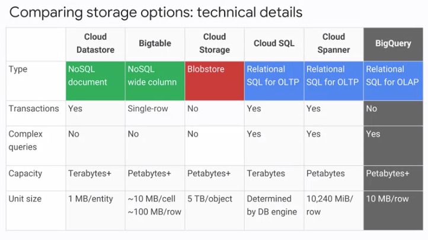
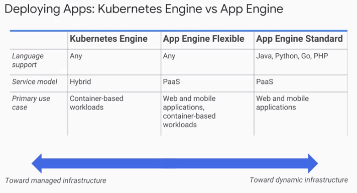

# Google Cloud Platform

Notes
from [Developing Applications with Google Cloud](https://www.coursera.org/specializations/developing-apps-gcp)

## Google Cloud Fundamentals: Core Infrastructure

### GCP Regions and Zones

- **Multi-Region** (eg _Europe_) -> **Region** (eg _europe-west2_) -> **Zone** (
  eg _europe_west2_a_)
- Zones within Regions have fast connectivity between them (< 5ms)
- Zone is not necessarily a single data centre
- Resources can be placed in different regions for fault-tolerance and to reduce
  latency for users by location
- Some resource support placement in _Multi-Region_, for example Google Cloud
  Storage
- Regions within a Multi_Region are seperated by at least 160km.

### GCP Resource Hierarchy

- Organisation -> Folders (optional) -> Project -> GCP Resources
- Resources are always placed in a single project
- Projects can optionally be organised with folders
- Folders can be placed beneath a Organisation Nodes
- Policies can be defined at any level in the hierarchy and are applied top-down
  to all items below it in the hierarchy - this means lower-level policies take
  precedence

- Project ID is assigned by user, used frequently and is immutable
- Project Name is for convenience and can be changed
- Project Number is assigned by Google and used less often

- Folders provide a convenient way of grouping Projects so that policies may be
  applied to multiple projects at once - less error-prone
- To user Folders must have an Organisation node at the top of the hierarchy
- If account is part of a Workspace account then there will be one automatically
  created
- If not, can use Google Cloud Identity to create one

### Identity and Access Management

- IAM Policies define _WHO_, _CAN DO WHAT_ on _WHICH RESOURCE_
- WHO can be a google account, group, a service account, entire workspace or a
  cloud identity domain
- CAN DO WHAT is defined by an IAM Role which is a set of related permissions
- IAM Primitive Roles are fixed, coarse-grained levels of access - Owner,
  Editor, Viewer, Billing Administrator
- IAM Pre-defined Roles apply to a particular GCP service in a project and offer
  more fine-grained permissions, depending on where they are applied
- IAM Custom Roles are even finer and are defined by the user and can only be
  defined at the project or organisation level - they cannot be applied to a
  folder

#### Service Accounts

- Control server-to-server interactions, ie authentication and privileges from
  one service to another
- Allows applications to perform actions on behalf of authenticated users
- Identified with an email address

### Interacting with GCP

- Web console
- Cloud shell / SDK cli tools: `gcloud`, `gsutil` and `bq`
- Cloud console mobile a
- REST APIs - can be turned on / off and tested with APIs Explorer

### Virtual Private Cloud (VPC) Network

- Default VPC is available
- VPC Networks have global scope and are contained within a GCP Project
- Subnets have regional scope, ie can span the zones that make up a region
- Can dynamically increase the size of a subnet by expanding the range of IP
  addresses allocated to it, without affecting already configured VMs
- Built-in routing tables and firewall - firewall configurable with meta tags
- VPC Peering allows connectivity between different VPCs (projects)
- Shared VPC uses IAM to give finer control over traffic between VPCs

### Compute Engine

- Create VMs with GCP console or gcloud, various images and machine types
- GPUs also available for ML / data processing
- Persistent storage available in standard and SSD
- Can also add local SSD for scratch space (not persistent)
- Start up scripts can be used to set up images
- Snapshots can be taken for backup / migration
- Preemptible instances can be created which can be close by GCE when resources
  are needed elsewhere - to save cost (??)
- Autoscaling (scale out) is available based on metrics and load balancing

### Cloud Load Balancing

- Fully distributed, software defined traffic management
- No VMs to manage, autoscaling and can put in front of any type of traffic
- A single, anycast IP is the frontend for all backend traffic
- Provides cross-region load balancing and multi-region failover
- Targets healthy backend services
- Types:
    - Global HTTP(s) - layer 7 load balancing
    - Global SSL Proxy - layer 4 load balancing for non-HTTP SSL, specific port
      numbers
    - Global TCP Proxy - layer 4 load balancing for non-HTTP SSL, specific port
      numbers
    - Regional - Any traffic, any port number (TCP/UDP)
    - Regional Internal - Same but for internal VPC traffic

### Cloud DNS

- Managed DNS service accessible via console, SDK

### Cloud CDN

- Globally distributed edge caches
- Some other CDN service can interconnect with Google's

### GCP Storage Options

#### Cloud Storage - Binary Object Storage

- Cloud storage is NOT a file system with a hierarchy of folders, and is not the
  same as block storage, ie os-managed chunks on disk
- It is storage of arbitrary chunks of bytes that are addressed with a unique
  key, often a url

- High performance, no capacity management, internet scale
- Data encrypted server-side, before it is written to disk (encryption at rest)
- Data in transit is also encrypted with HTTPS

- Objects are are assigned to _buckets_ which have a globally unique name, a
  geographic location and a storage class
- Bucket access managed with IAM policies or Access Control Lists (ACLs)
- Object access controlled with ACLs
- Each ACL consists of two pieces of information:
    - _Scope_: who can perform the specified actions, eg a user or a group
    - _Action_: what action can be performed, eg read

- Objects are immutable, so new objects (at same key) will replace current
- Versioning can be turned on in which case previous versions are kept
- Versioning can be managed with lifecycle policies

- Storage classes:
    - **Multi-regional**:
        - geographically redundant
        - highest storage cost per GB, low transfer cost
        - best for content storage and delivery
    - **Regional**:
        - not geographically redundant
        - lower storage cost than multi-regional, low transfer cost
        - good for analytics, transcoding
    - **Nearline**:
        - lower storage cost, higher transfer cost
        - good for infrequent access, eg once per month, backups
    - **Coldline**:
        - lowest storage cost, highest transfer cost
        - good for archiving, disaster recovery, eg yearly access

- Transfer to Cloud Storage
    - Online transfer with CLI or web UI
    - Storage Transfer Service (online) - scheduled, managed batched transfers
      from other cloud providers or HTTP endpoint
    - Transfer Appliance - a piece of hardware which is loaded with data (up to
      1PB) on-premise, then shipped to a location where data is transferred to
      Google

- Cloud storage works with other GCP services such as databases etc

#### Bigtable

- Fully managed NoSQL wide-column database service for terabyte applications
- Like a persistent hash table
- For storing large amounts of data with low-latency
- Accessed using HBase API (Apache Hadoop Project)
- Data encrypted in flight and at rest
- Access control with IAM

#### Cloud Datastore

- Horizontally scalable NoSQL document database
- Designed for application backends storing structured data
- Can span App Engines and Compute Engine applications
- Automatically handles scaling - sharding and replication
- Supports transactions (unlike Bigtable)
- Supports sql-like queries
- Offers free daily quota

#### Cloud SQL

- Managed RDBMS - MySQL and PostgreSQL
- Provides replica services: read, failover, external replica
- Managed backups
- Vertical scaling (read / write)
- Horizontal scaling (read)
- Security firewalls and data encryption

#### Cloud Spanner

- horizontally scalable RDBMS
- Transactional consistency at a global scale
- Managed instances, high availability

#### Big Query

(see later)

#### Use cases

### Kubernetes Engine

### App Engine

- Compute engine and Kubernetes Engine require some management of underlying
  infrastructure.
- App Engine is a PaaS and manages all the underlying infrastructure
  automatically, including scaling.
- Especially suited for application where workload is highly variable or
  unpredictable.
- Two App Engine environments: _Standard_ and _Flexible_

- Standard (very similar to Heroku):
    - Simple deployment experience, free tier
    - SDKs available for testing App locally in same environment before
      uploading
    - Uses a runtime provided by Google, eg Java, Python, PHP, Go.
    - If need other language must use _flexible_ environment
    - App runs in a sandbox with the following constraints:
        - No writing to local files
        - All requests timeout at 60 seconds
        - Limits on third-party software

- Flexible environment:
    - App runs in Docker containers on VMs, no sandbox constraints
    - Container platform is managed by App Engine and can choose region
    - Can access standard App Engine resources and can use any language
    - ssh access

### GC Endpoints and Apigee Edge

- Two API management tools
- Cloud Endpoints:
    - Distributed API management with a web console
    - Expose APi through RESTful interface
    - Ideal for providing API to other GC developers
    - Easily deployed proxy for other GC services
    - Access control with JWT and Google API keys
    - User auth with Auth0 and Firebase Auth
    - Generate client libraries
    - Supports App Engine (Flexible), Kubernetes Engine and Compute Engine
- Apigee Edge:
    - Focus on business issues like rate limited, quota and analytics
    - Ideal for providing API services to other businesses
    - Contains analytics, monetization and developer portal
    - Backend services don't have to be GCP so it is also good when taking apart
      a legacy application and slowly moving it over to GCP

### Cloud Source Repositories

- Full-featured git repos hosted on GCP
- Any number of private repos and can use IAM for access
- Includes source viewer

### Cloud Functions

- Single-purpose functions that respond to events
- No server or runtime to manage
- Written in JS and run on managed Node.js on GCP
- Triggered by events like save to Cloud Storage, Pub Sub, HTTP call

### Deployment Manager: Infrastructure as Code

- Setting up infrastructure manually with cli commands (ie, an _imperative_
  approach) is unless things need to be changed regularly
- A _declarative_ approach, using templates, is easier to manage and repeat
- Uses a yaml or python markup file

### Monitoring: Proactive instrumentation

- Google provides Stackdriver for this purpose
- Six areas:
    - Monitoring of platform, system and application metrics, uptime, health etc
    - Logging of various things
    - Trace latency reporting and sampling
    - Error reporting
    - Debugging
    - Profiler - continuous profiling of cpu and memory usage

### Big data platform

- GC big data services are fully managed and scalable

#### Cloud Dataproc

- Managed Apache Hadoop
- Fast and easy way to run Hadoop, Spark/Hive/Pig on GCP
- Hadoop is a MapReduce, ie a "map" function running on large data set and
  creating an intermediate result and a "reduce" function that produced a final
  result from the intermediate results
- Can scale up or down while jobs are running
- Can monitor with Stackdriver
- Can save money by using preemptible instance for batch processing
- Once data is in a cluster can use Spark Machine Learning Libraries (MLlib) to
  run classification algorithms

#### Cloud Dataflow

- A good choice for realtime or unpredictable data
- Used to build data pipelines which work for both batch and streaming data -
  Extract, Transform and Load (ETL), batch computation and continuous
  computation
- eg: Source from BigQuery -> Transform -> Sink to Cloud Storage

#### BigQuery

- Fully managed data warehouse
- Provides near real-time interactive analysis of massive data sets using SQL
  2011 syntax
- Charges are separated for storage and queries so can store data and other
  parties can run queries at their own cost

#### Cloud Pub/Sub

- Supports many-to-many async messaging
- App components make push /pull subscriptions to topics
- Includes support for offline consumers
- Good for high / unpredictable data such as IoT, and other streaming data

#### Cloud Datalab

- Integrated tool for large scale data analysis, transformation and
  visualization
- Built on Jupyter
- Integrated with BigQuery, Compute Engine and Cloud Storage and these are what
  is charged, Datalab itself has no additional charge.

#### Machine Learning Platform

- Provides pre-trained models and a platform to generate your own models
- TensorFlow can be run on CPU or GPU
- Range of machine learning APIs that can be integrated into apps
- Cloud Vision API can analyse images with REST api, eg logo / label detection
- Cloud Speech API can transcribe and analyse speech in real time
- Cloud Translation API translates an arbitrary string into another language
- Cloud Video Intelligence API can annotate the contents of video

