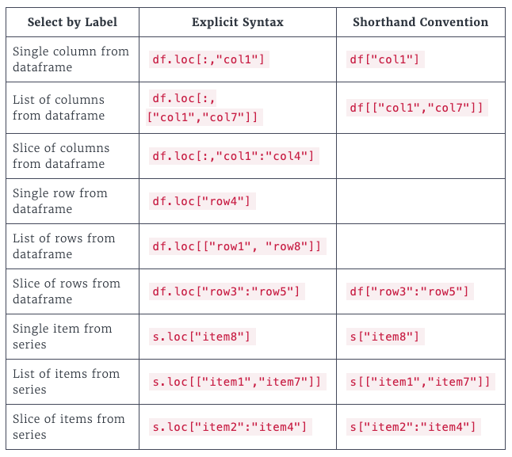

# Data Science with Python


## [pandas](https://pandas.pydata.org/)

- Used to work with _rectangular_ (table) data called **dataframes**
- Built on top of [numpy](https://numpy.org/) and [matplotlib](https://matplotlib.org/) 


### Creating dataframes

```
# from a list of dictionaries - constructed row-by-row
list_of_dicts = [
    {"col1": "aaa", "col2": "bbb"},
    {"col1": "ccc", "col2": "ddd"},
]
df = pd.DataFrame(list_of_dicts) 

# from a dictionary of lists - constructed column-by-column
dict_of_lists = {
    "col1": ["aaa", "ccc"], # all values in col1
    "col2": ["bbb", "ddd"], # all values in col2
}
df = pd.DataFrame(dict_of_lists)
```

### Working with dataframes


```python
import pandas as pd

# inspect data (df = some data frame)
df.head()      # first few rows
df.info()      # information about columns and value types
df.describe()  # some stats
df.shape       # (rows, columns)
df.columns     # list of column names
df.index       # list of row index numbers

# selecting columns [row,col] (explicit)
df.loc[:, "colname"]
df.loc[:, ["col1", "col2"]]
df.loc[:, ["col1":"col7"]]

# selecting columns (shorthand)
df["colname"]        # view one column
df[["col1", "col2"]] # view multi - note subset is a list 

# selecing rows
df.loc["rowname",]

# Sorting data
df.sort_values("colname", ascending=False)                # sort descending
df.sort_values(["col1", "col2"], ascending=[True, False]) # sort multi column

# subsetting data using a logical condition
df["colname"] > 10        # returns list of bool, ie for each row
df[df["colname"] > 10]    # can be used to subset 

# subsetting with multiple conditions
condition1 = df["colname"] == "value"
condition2 = df["date"] > "1999-12-31"head
df[condition1 & condition2]

# subsetting with `isin()`
df[df["colname"].isin(["aaa", "bbb"])]

# Adding new data
df["newcolumn"] = df["colname"] * 2.6

# Summary stats 
df["colname"].mean()
df["colname"].median()
df["colname"].mode()
df["colname"].min()
df["colname"].max()
df["colname"].var()
df["colname"].std()
df["colname"].sum()
df["colname"].quantile()

# Aggregate used to implement custom stats functions
df["colname"].agg(funcname)               # returns the aggregated result of funcname on the data column 
df[["col1", "col2"]].agg([func1, func2])  # same but with multiple columns and multiple funcs

# Cumulative stat funcs return an entire column of the dataframe
df["colname"].cumsum()  # returns cumulative sum by row
df["colname"].cummax()  # returns cumulative maximum
df["colname"].cummin()  # returns cumulative minimum
df["colname"].cumprod() # returns cumulative product


# Dropping duplicates
df.drop_duplicates(subset="colname")         # drops duplicate rows based on value in colname
df.drop_duplicates(subset=["col1", "col2"])  # drops duplicate rows based on pair value in col1 and col2

# Counting (series)
df["colname"].value_counts()                  # count
df["colname"].value_counts(sort=True)         # count and sort
df["colname"].value_counts(normalize=True)    # counts as proportion of total

# Grouped summaries
df.groupby("col1")["col2"].mean()                 # mean of col2 when grouped by col1
df.groupby("col1")["col2"].agg([min, max, sum])   # aggregated stats on same grouping
df.groupby(["col1", "col2"]).mean()               # group by multiple variables 
df.groupby(["col1", "col2"]).agg([min, max, sum]) # aggregate stats with multiple grouping

# Summary stats using pivot tables
df.pivot_table(values="statscolumn", index="groupingcolumn")                               # gives mean by default
df.pivot_table(values="statscolumn", index="groupingcolumn1", columns="groupingcolumn2")   # group by second columns
df.pivot_table(values="statscolumn", index="groupingcolumn", aggfunc=np.median)            # specify agg function
df.pivot_table(values="statscolumn", index="groupingcolumn", aggfunc=[np.mean, np.median]) # multiple agg function
df.pivot_table(values="statscolumn", index="groupingcolumn", fill_value=0)                 # replaces NaN for missing data
df.pivot_table(values="statscolumn", index="groupingcolumn", margins=True)                 # adds All row and column

```

### Explicit Indexes

Pandas data frames consist of three parts: A numpy array to store the data, and two indexes to store the row details.

- `.index` stores an index object of row numbers
- `.columns` stores and index object of column names

You can move a column from the body of a data frame to the index - called _setting an index_.

```python
df.set_index("colname")          # changes the index
df.set_index(["col1", "col2"])   # multi-level (hierarchical) index
df.reset_index(drop=True)        # sets it back and (optionally) drop the current one completely
```

Indexes make subsetting simpler, for example to find dogs with the name `Bella` or `Stella`:

```python
dogs[dogs["name"].isin(["Bella", "Stella"])] # normal way
dogs.set_index("names")                      # index "names"   
dogs_ind.loc[["Bella", "Stella"]]            # using `loc` subsetting method to filter index values
```

Subsetting on a multi-level index is also possible by passing a list of tuples to .`loc()`. 
For example, if the outer index was `col1` and the inner index was `col2`:

```python
df.loc[[("col1_val1", "col2_val1"), ("col1_val2", "col2_val2")]] # subset inner levels with a list of tuples
```  

`.sort_index()` will sort by indexes, by default from outer to inner indexes in ascending order.

Can also sort by multiple cols, eg:

```python
# Sort temperatures_ind by country then descending city
temps_idx.sort_index(level=["country", "city"], ascending=[True, False])
```

Slicing and subsetting can also be done with `.loc` and `.iloc`

**To slice an index on a data frame it must be sorted**

To slice at the outer index use index names, for example:

```python
df.sort_index()
df.loc["col1_val1":"col1_val2"]
```

Note that, unlike normal list slicing, the second index is _included_ in the result.

Slicing inner indexes is tricky because, if done incorrectly, you may not see an error, for example:

```python
df.loc["col2_val1":"col2_val2"]   # empty set but no error
```

The correct way to slice on an inner index is to pass tuples corresponding to the first _and_ last positions, eg:

```python
df.loc[("col1_val1", "col2_val1"):("col1_val2", "col2_val2")]
```

A common technique is to index by date and then be able to slice rows by date ranges. The dates can be full 
or partial, which is handy:

```python
temperatures_ind["2010-08-03":"2011-02-15"]
temperatures_ind["2010-08":"2011-02"]
temperatures_ind["2010":"2011"]
```

_Summary of label selection mechanisms_




Slicing with `.iloc` is done using index numbers, and in this case the final value is _not_ included.

```python
df.iloc[2:5, 1:4]  # rows 2,3,4 cols 1,2,3
```

The same slicing techniques shown above can be used on pivot tables. 

Indexes have some weak points: index values are just data values and they also violate "tidy" data principles.

Also requires the use of two different syntaxes.

ref: [Pandas loc](https://pandas.pydata.org/pandas-docs/stable/reference/api/pandas.DataFrame.loc.html?highlight=loc#pandas.DataFrame.loc)


## Visualisations using [matplotlib](https://matplotlib.org/)

```python
import matplotlib.pyplot as plt # standard alias is plt

df["colname"].hist()         # histogram shows distribution of a numeric variable 
df["colname"].hist(bins=20)  # change default (10) number of bins
plt.show()                   # shows the plot

avg_by_cat = ...                # for bar plot need category and values columns in a dataframe
avg_by_cat.plot(kind="bar")     # bar plots show values for categorical vs numeric variable
plt.show()

df.plot(x="date", y="kg", kind="line")  # line plots are good for showing changes in numeric variables over time
plt.show()

df.plot(x="height", y="weight", kind="scatter") # scatter plots show relationships between two numeric variables
plt.show()

# Plots can be layered (may need a legend and opacity for clarity with histograms)
df["col1"].hist()
df["col2"].hist()
plt.show()
```

## Missing values

- In a dataframe missing values are indicated by `NaN` or `None`

```python
df.isna()         # shows bool for presence of all values
df.isna().any()   # shows if any values missing for entire column (easier to read)
df.isna().sum()   # counts missing values in each column, and then can bar plot to visualise

df.dropna()       # drop rows with missing values, same as df.dropna(axis=0)
df.dropna(axis=1) # drop cols with missing values
df.fillna(0)      # replaces missing values with a value - also may not be ideal depending on data
```

### Working with CSVs 

```python
df = pd.read_csv("data.csv") # read csv at file path
df.to_csv("new_data.csv")    # write to a csv
```


### Working with datetimes

- If a csv contains datetimes can tell pandas to parse them on load

```python
data = pd.read_csv("data.csv", parse_dates = ["date col1", "date col 2"])
```

- It will try to determine format automatically, if it can't use `pd.to_datetime()`

```python
data["date col1"] = pd.to_datetime(data["date col1"], format="%Y-%m-%d %H:%M:%S")
```

- pandas uses a `pandas.timestamp` object which can be used similarly to a `datetime` 
- Can use `.mean()`, `.sum()` etc on a timedelta column


- `.resample()` can be used for frequency stats, eg to change to months... like grouping by date level


- Timezones are also an important factor working with pandas 
- To set a timezone use `.dt.tz_localize()`

```python
data['date col'].dt.tz_localize('Australia/Sydney')
```

- assigning timezone info to pandas datetime series, where one or more values occurs in the daylight savings _fold_, 
 will result in an `AmbiguousTimeError`
- handle _ambiguous_ times with `ambiguous='NaT'` (not a time)

```python
data['date col'].dt.tz_localize('Australia/Sydney', ambiguous="NaT")
```

- `.dt.tz_convert()` is used where datetimes are already timezone-aware


 
